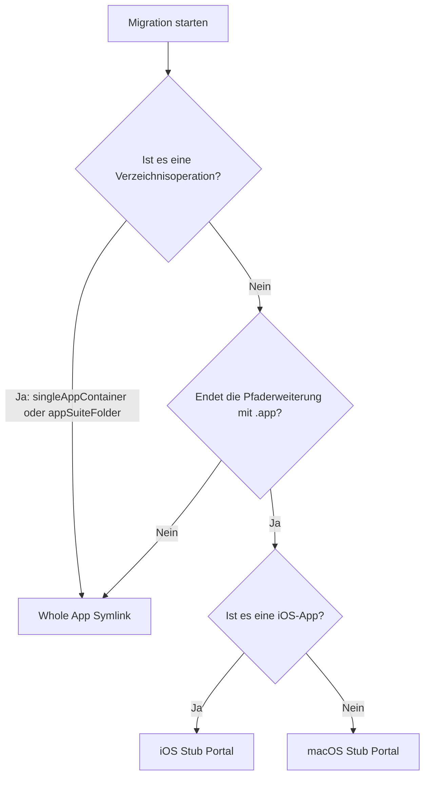

# Migrationsstrategien

## App-Container-Klassifizierung

AppPorts klassifiziert Apps vor der Migration, um die Migrationsgranularität zu bestimmen:

| Klassifizierung | Definition | Beispiel |
|-----------------|------------|---------|
| `standaloneApp` | Einzelnes `.app`-Paket im obersten Verzeichnis | Safari, Finder |
| `singleAppContainer` | Verzeichnis, das nur 1 `.app`-Paket enthält | Einige Drittanbieter-App-Installationsverzeichnisse |
| `appSuiteFolder` | Verzeichnis, das 2 oder mehr `.app`-Pakete enthält | Microsoft Office, Adobe Creative Cloud |

Klassifizierungsergebnisse beeinflussen die Auswahl der Migrationsstrategie — `singleAppContainer` und `appSuiteFolder` migrieren das gesamte Verzeichnis als Einheit, anstatt einzelne `.app`-Dateien darin zu verarbeiten.

## Drei Migrationsstrategien

AppPorts definiert drei lokale Eintrags- (Portal-) Strategien, um Apps nach der Migration lokal startbar zu halten:

### Whole App Symlink

Erstellt das gesamte `.app`-Verzeichnis (oder Verzeichnis) als symbolischen Link, der auf den externen Speicher verweist.

```text
/Applications/SomeApp.app → /Volumes/External/SomeApp.app
```

**Anwendungsfälle:**

- App-Container-Klassifizierung ist `singleAppContainer` oder `appSuiteFolder` (Verzeichnisoperation)
- Nicht-standardmäßige Apps mit Pfaderweiterungen außer `.app`

**Eigenschaften:** Der Finder zeigt Pfeilverknüpfungsmarker auf Icons an.

### Deep Contents Wrapper (Contents-Verzeichnismigration)

Erstellt lokal ein echtes `.app`-Verzeichnis, wobei nur das `Contents/`-Unterverzeichnis symbolisch auf den externen Speicher verlinkt ist.

```text
/Applications/SomeApp.app/
└── Contents → /Volumes/External/SomeApp.app/Contents  (symlink)
```

**Aktueller Status:** Veraltet. Neue Migrationen verwenden diese Strategie nicht mehr; sie wird nur noch erkannt und behandelt, wenn Apps wiederhergestellt werden, die mit älteren Versionen migriert wurden.

**Veraltungsgrund:** Selbst-Updater folgen dem `Contents/`-symbolischen Link und operieren direkt auf externe Speicherdateien, was die Anwendung beschädigen kann.

### Stub Portal

Erstellt lokal eine minimale `.app`-Hülle, die `open` aufruft, um die echte App auf dem externen Speicher über ein Launch-Skript zu starten.

```text
/Applications/SomeApp.app/
├── Contents/
│   ├── MacOS/launcher                    # Nativer Binärstarter (oder Bash-Skript)
│   ├── Resources/real_app_path.txt       # Externer Pfad der echten App
│   ├── Resources/AppIcon.icns            # Von der echten App kopiertes Icon
│   ├── Info.plist              # Vereinfachte Konfigurationsdatei
│   └── PkgInfo                 # Standard-Kennungsdatei
```

**Anwendungsfälle:** Alle Apps mit `.app`-Erweiterung (Standardstrategie).

**Eigenschaften:** Keine symbolischen Links lokal; der Finder zeigt keine Pfeilmarker an; Auto-Updater können nicht durchdringen.

#### macOS Stub Portal

Für native macOS-Apps:

1. Nativen Binärstarter erstellen und externen App-Pfad in `real_app_path.txt` schreiben
2. `PkgInfo`- und Icon-Dateien von der externen App kopieren
3. Vereinfachte `Info.plist` aus der externen App-`Info.plist` generieren:
   - `CFBundleExecutable` auf `launcher` setzen
   - `LSUIElement` auf `true` setzen (nicht im Dock angezeigt)
   - Sparkle-/Electron-bezogene Konfigurationsschlüssel entfernen
   - `.appports.stub`-Suffix an Bundle ID anhängen
4. Ad-hoc-Code-Signierung ausführen

#### iOS Stub Portal

Für iOS-Apps (iOS-Apps, die auf dem Mac laufen), Unterschiede zur macOS-Version:

- Icons aus `.app`-Paketen in `Wrapper/`- oder `WrappedBundle/`-Verzeichnissen extrahiert
- Verwendet `sips` zum Skalieren von PNG auf 256×256 und Konvertieren ins `.icns`-Format
- `Info.plist` wird aus `iTunesMetadata.plist` generiert (iOS-Apps enthalten keine standardmäßige `Info.plist`)
- Keine Code-Signierung; nur Bereinigung erweiterter Attribute (`xattr -cr`)

## Strategieauswahl-Entscheidungsbaum



::: tip Über Deep Contents Wrapper
Diese Strategie wird in der aktuellen Version nicht mehr für neue Migrationen ausgewählt. Die Methode `preferredPortalKind()` gibt `stubPortal` für alle `.app`-Apps zurück. Deep Contents Wrapper wird nur noch als Legacy-Schema erkannt, wenn historisch migrierte Apps wiederhergestellt werden.
:::
