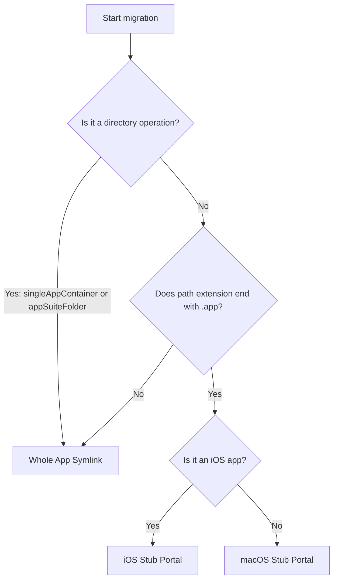

# Migration Strategies

## App Container Classification

AppPorts classifies apps before migration to determine migration granularity:

| Classification | Definition | Example |
|----------------|------------|---------|
| `standaloneApp` | Single `.app` package in the top-level directory | Safari, Finder |
| `singleAppContainer` | Directory containing only 1 `.app` package | Some third-party app install directories |
| `appSuiteFolder` | Directory containing 2 or more `.app` packages | Microsoft Office, Adobe Creative Cloud |

Classification results affect migration strategy selection — `singleAppContainer` and `appSuiteFolder` migrate the entire directory as a unit, rather than processing individual `.app` files within.

## Three Migration Strategies

AppPorts defines three local entry (Portal) strategies for keeping apps launchable locally after migration:

### Whole App Symlink

Creates the entire `.app` directory (or directory) as a symbolic link pointing to external storage.

```text
/Applications/SomeApp.app → /Volumes/External/SomeApp.app
```

**Use Cases:**

- App container classification is `singleAppContainer` or `appSuiteFolder` (directory operation)
- Non-standard apps with path extensions other than `.app`

**Characteristics:** Finder displays arrow shortcut markers on icons.

### Deep Contents Wrapper (Contents Directory Migration)

Creates a real `.app` directory locally, with only the `Contents/` subdirectory symbolically linked to external storage.

```text
/Applications/SomeApp.app/
└── Contents → /Volumes/External/SomeApp.app/Contents  (symlink)
```

**Current Status:** Deprecated. New migrations no longer use this strategy; it is only recognized and handled when restoring apps migrated with older versions.

**Deprecation Reason:** Self-updaters follow the `Contents/` symbolic link and directly operate on external storage files, potentially corrupting the application.

### Stub Portal

Creates a minimal `.app` shell locally, calling `open` to launch the real app on external storage via a launch script.

```text
/Applications/SomeApp.app/
├── Contents/
│   ├── MacOS/launcher                    # native binary launcher (or bash script)
│   ├── Resources/real_app_path.txt       # external real app path
│   ├── Resources/AppIcon.icns            # icon copied from real app
│   ├── Info.plist              # simplified config file
│   └── PkgInfo                 # standard identifier file
```

**Use Cases:** All apps with `.app` extension (default strategy).

**Characteristics:** No symbolic links locally; Finder does not display arrow markers; auto-updaters cannot penetrate through.

#### macOS Stub Portal

For native macOS apps:

1. Create native binary launcher and write external app path to `real_app_path.txt`
2. Copy `PkgInfo` and icon files from the external app
3. Generate simplified `Info.plist` from the external app's `Info.plist`:
   - Set `CFBundleExecutable` to `launcher`
   - Set `LSUIElement` to `true` (not shown in Dock)
   - Remove Sparkle/Electron related config keys
   - Append `.appports.stub` suffix to Bundle ID
4. Execute Ad-hoc code signing

#### iOS Stub Portal

For iOS apps (iOS apps running on Mac), differences from macOS version:

- Icons extracted from `.app` packages in `Wrapper/` or `WrappedBundle/` directories
- Uses `sips` to scale PNG to 256×256 and convert to `.icns` format
- `Info.plist` generated from `iTunesMetadata.plist` (iOS apps don't include standard `Info.plist`)
- No code signing; only cleans extended attributes (`xattr -cr`)

## Strategy Selection Decision Tree



::: tip About Deep Contents Wrapper
This strategy is no longer selected for new migrations in the current version. The `preferredPortalKind()` method returns `stubPortal` for all `.app` apps. Deep Contents Wrapper is only recognized as a legacy scheme when restoring historically migrated apps.
:::
