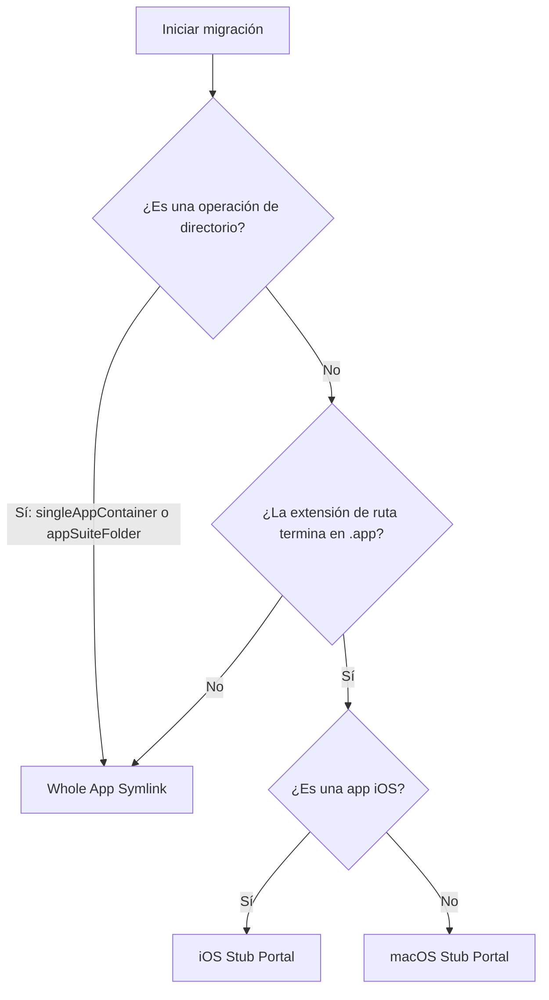

# Estrategias de Migración

## Clasificación de Contenedores de Aplicaciones

AppPorts clasifica las aplicaciones antes de la migración para determinar la granularidad de la migración:

| Clasificación | Definición | Ejemplo |
|---------------|-----------|---------|
| `standaloneApp` | Paquete `.app` único en el directorio de nivel superior | Safari, Finder |
| `singleAppContainer` | Directorio que contiene solo 1 paquete `.app` | Algunos directorios de instalación de apps de terceros |
| `appSuiteFolder` | Directorio que contiene 2 o más paquetes `.app` | Microsoft Office, Adobe Creative Cloud |

Los resultados de la clasificación afectan la selección de estrategia de migración — `singleAppContainer` y `appSuiteFolder` migran el directorio completo como una unidad, en lugar de procesar archivos `.app` individuales dentro.

## Tres Estrategias de Migración

AppPorts define tres estrategias de entrada local (Portal) para mantener las aplicaciones iniciables localmente después de la migración:

### Whole App Symlink

Crea el directorio `.app` completo (o directorio) como un enlace simbólico que apunta al almacenamiento externo.

```text
/Applications/SomeApp.app → /Volumes/External/SomeApp.app
```

**Casos de Uso:**

- La clasificación del contenedor de la app es `singleAppContainer` o `appSuiteFolder` (operación de directorio)
- Apps no estándar con extensiones de ruta distintas a `.app`

**Características:** Finder muestra marcadores de flecha de acceso directo en los iconos.

### Deep Contents Wrapper (Migración del Directorio Contents)

Crea un directorio `.app` real localmente, con solo el subdirectorio `Contents/` enlazado simbólicamente al almacenamiento externo.

```text
/Applications/SomeApp.app/
└── Contents → /Volumes/External/SomeApp.app/Contents  (symlink)
```

**Estado Actual:** Obsoleto. Las nuevas migraciones ya no usan esta estrategia; solo se reconoce y maneja al restaurar aplicaciones migradas con versiones anteriores.

**Razón de Obsolescencia:** Los auto-actualizadores siguen el enlace simbólico `Contents/` y operan directamente en los archivos del almacenamiento externo, lo que puede corromper la aplicación.

### Stub Portal

Crea un shell `.app` mínimo localmente, que llama a `open` para iniciar la app real en el almacenamiento externo mediante un script de lanzamiento.

```text
/Applications/SomeApp.app/
├── Contents/
│   ├── MacOS/launcher          # lanzador binario nativo (o script bash)
│   ├── Resources/AppIcon.icns  # icono copiado de la app real
│   ├── Resources/real_app_path.txt  # ruta de la app real en almacenamiento externo
│   ├── Info.plist              # archivo de configuración simplificado
│   └── PkgInfo                 # archivo identificador estándar
```

**Casos de Uso:** Todas las apps con extensión `.app` (estrategia predeterminada).

**Características:** Sin enlaces simbólicos localmente; Finder no muestra marcadores de flecha; los actualizadores automáticos no pueden penetrar.

#### Stub Portal de macOS

Para aplicaciones macOS nativas:

1. Crea el lanzador binario nativo Mach-O `Contents/MacOS/launcher` (o script bash como alternativa) y el archivo `Contents/Resources/real_app_path.txt` con la ruta de la app real en almacenamiento externo
2. Copia `PkgInfo` y archivos de icono de la app externa
3. Genera `Info.plist` simplificado del `Info.plist` de la app externa:
   - Establece `CFBundleExecutable` en `launcher`
   - Establece `LSUIElement` en `true` (no se muestra en el Dock)
   - Elimina claves de configuración relacionadas con Sparkle/Electron
   - Añade sufijo `.appports.stub` al Bundle ID
4. Ejecuta firmado de código Ad-hoc

#### Stub Portal de iOS

Para aplicaciones iOS (apps iOS ejecutándose en Mac), diferencias con la versión macOS:

- Iconos extraídos de paquetes `.app` en directorios `Wrapper/` o `WrappedBundle/`
- Usa `sips` para escalar PNG a 256×256 y convertir a formato `.icns`
- `Info.plist` generado desde `iTunesMetadata.plist` (las apps iOS no incluyen `Info.plist` estándar)
- Sin firmado de código; solo limpia atributos extendidos (`xattr -cr`)

## Árbol de Decisión de Selección de Estrategia



::: tip Sobre Deep Contents Wrapper
Esta estrategia ya no se selecciona para nuevas migraciones en la versión actual. El método `preferredPortalKind()` devuelve `stubPortal` para todas las apps `.app`. Deep Contents Wrapper solo se reconoce como un esquema heredado al restaurar apps migradas históricamente.
:::
