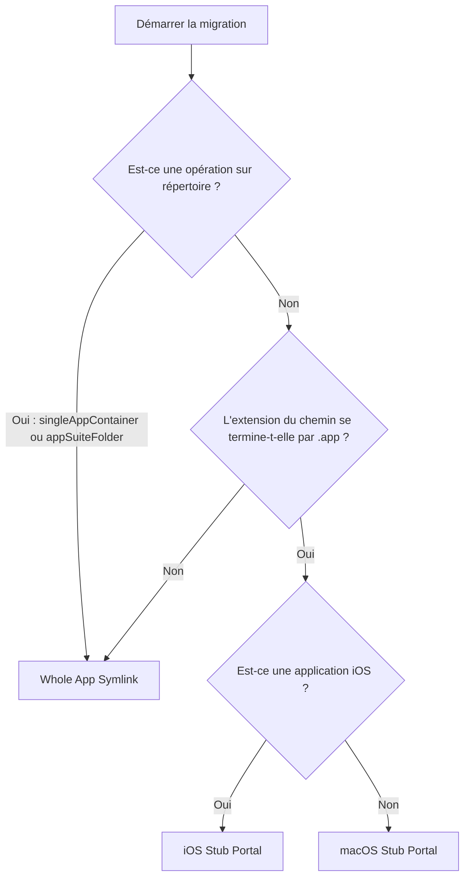

# Stratégies de migration

## Classification des conteneurs d'application

AppPorts classifie les applications avant la migration pour déterminer la granularité de migration :

| Classification | Définition | Exemple |
|----------------|------------|---------|
| `standaloneApp` | Package `.app` unique dans le répertoire de premier niveau | Safari, Finder |
| `singleAppContainer` | Répertoire contenant uniquement 1 package `.app` | Certains répertoires d'installation d'applications tierces |
| `appSuiteFolder` | Répertoire contenant 2 packages `.app` ou plus | Microsoft Office, Adobe Creative Cloud |

Les résultats de classification affectent la sélection de stratégie de migration — `singleAppContainer` et `appSuiteFolder` migrent le répertoire entier en tant qu'unité, plutôt que de traiter les fichiers `.app` individuels à l'intérieur.

## Trois stratégies de migration

AppPorts définit trois stratégies de point d'entrée local (Portal) pour maintenir les applications lancables localement après la migration :

### Whole App Symlink

Crée le répertoire `.app` entier (ou le répertoire) comme un lien symbolique pointant vers le stockage externe.

```text
/Applications/SomeApp.app → /Volumes/External/SomeApp.app
```

**Cas d'utilisation :**

- La classification du conteneur d'application est `singleAppContainer` ou `appSuiteFolder` (opération sur répertoire)
- Applications non standard avec des extensions de chemin autres que `.app`

**Caractéristiques :** Le Finder affiche des marqueurs de raccourci fléchés sur les icônes.

### Deep Contents Wrapper (Migration du répertoire Contents)

Crée un répertoire `.app` réel localement, avec uniquement le sous-répertoire `Contents/` lié symboliquement au stockage externe.

```text
/Applications/SomeApp.app/
└── Contents → /Volumes/External/SomeApp.app/Contents  (symlink)
```

**Statut actuel :** Obsolète. Les nouvelles migrations n'utilisent plus cette stratégie ; elle est uniquement reconnue et gérée lors de la restauration d'applications migrées avec des versions antérieures.

**Raison de l'obsolescence :** Les mises à jour automatiques suivent le lien symbolique `Contents/` et opèrent directement sur les fichiers du stockage externe, pouvant corrompre l'application.

### Stub Portal

Crée un shell `.app` minimal localement, appelant `open` pour lancer la vraie application sur le stockage externe via un script de lancement.

```text
/Applications/SomeApp.app/
├── Contents/
│   ├── MacOS/launcher          # lanceur binaire natif (ou script bash)
│   ├── Resources/AppIcon.icns  # icône copiée de la vraie application
│   ├── Resources/real_app_path.txt  # chemin de la vraie application sur le stockage externe
│   ├── Info.plist              # fichier de configuration simplifié
│   └── PkgInfo                 # fichier identifiant standard
```

**Cas d'utilisation :** Toutes les applications avec extension `.app` (stratégie par défaut).

**Caractéristiques :** Aucun lien symbolique localement ; le Finder n'affiche pas de marqueurs fléchés ; les mises à jour automatiques ne peuvent pas pénétrer à travers.

#### macOS Stub Portal

Pour les applications macOS natives :

1. Créer le lanceur binaire natif Mach-O `Contents/MacOS/launcher` (ou script bash comme alternative) et le fichier `Contents/Resources/real_app_path.txt` contenant le chemin de la vraie application sur le stockage externe
2. Copier `PkgInfo` et les fichiers d'icône depuis l'application externe
3. Générer un `Info.plist` simplifié à partir du `Info.plist` de l'application externe :
   - Définir `CFBundleExecutable` sur `launcher`
   - Définir `LSUIElement` sur `true` (non affiché dans le Dock)
   - Supprimer les clés de configuration liées à Sparkle/Electron
   - Ajouter le suffixe `.appports.stub` au Bundle ID
4. Exécuter la signature de code Ad-hoc

#### iOS Stub Portal

Pour les applications iOS (applications iOS exécutées sur Mac), différences avec la version macOS :

- Icônes extraites des packages `.app` dans les répertoires `Wrapper/` ou `WrappedBundle/`
- Utilise `sips` pour redimensionner le PNG à 256×256 et convertir au format `.icns`
- `Info.plist` généré à partir de `iTunesMetadata.plist` (les applications iOS n'incluent pas de `Info.plist` standard)
- Pas de signature de code ; nettoyage uniquement des attributs étendus (`xattr -cr`)

## Arbre de décision de sélection de stratégie



::: tip À propos de Deep Contents Wrapper
Cette stratégie n'est plus sélectionnée pour les nouvelles migrations dans la version actuelle. La méthode `preferredPortalKind()` retourne `stubPortal` pour toutes les applications `.app`. Deep Contents Wrapper est uniquement reconnu comme un schéma hérité lors de la restauration d'applications migrées historiquement.
:::
