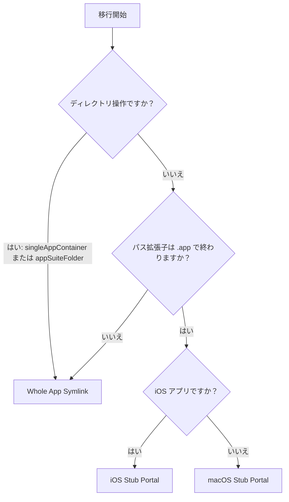

# 移行戦略

## アプリコンテナ分類

AppPorts は、移行前にアプリを分類して移行の粒度を決定します：

| 分類 | 定義 | 例 |
|------|------|-----|
| `standaloneApp` | トップレベルディレクトリに単一の `.app` パッケージ | Safari、Finder |
| `singleAppContainer` | 1つの `.app` パッケージのみを含むディレクトリ | 一部のサードパーティアプリインストールディレクトリ |
| `appSuiteFolder` | 2つ以上の `.app` パッケージを含むディレクトリ | Microsoft Office、Adobe Creative Cloud |

分類結果は移行戦略の選択に影響し、`singleAppContainer` と `appSuiteFolder` は、中の個々の `.app` ファイルを処理するのではなく、ディレクトリ全体を単位として移行します。

## 3つの移行戦略

AppPorts は、移行後もアプリをローカルから起動可能にするための3つのローカルエントリ（Portal）戦略を定義しています：

### Whole App Symlink

`.app` ディレクトリ全体（またはディレクトリ）をシンボリックリンクとして外部ストレージに作成します。

```text
/Applications/SomeApp.app → /Volumes/External/SomeApp.app
```

**使用ケース：**

- アプリコンテナ分類が `singleAppContainer` または `appSuiteFolder`（ディレクトリ操作）
- `.app` 以外のパス拡張子を持つ非標準アプリ

**特徴:** Finder にアイコンに矢印ショートカットマークが表示されます。

### Deep Contents Wrapper（Contents ディレクトリ移行）

ローカルに実際の `.app` ディレクトリを作成し、`Contents/` サブディレクトリのみをシンボリックリンクで外部ストレージにリンクします。

```text
/Applications/SomeApp.app/
└── Contents → /Volumes/External/SomeApp.app/Contents  (symlink)
```

**現在のステータス:** 非推奨。新しい移行ではこの戦略は使用されず、旧バージョンで移行されたアプリを復元する場合にのみ認識・処理されます。

**非推奨の理由:** 自動更新プログラムが `Contents/` シンボリックリンクをたどって外部ストレージファイルを直接操作し、アプリケーションを破損する可能性があるため。

### Stub Portal

ローカルに最小限の `.app` シェルを作成し、`open` を呼び出してランチスクリプト経由で外部ストレージ上の実際のアプリを起動します。

```text
/Applications/SomeApp.app/
├── Contents/
│   ├── MacOS/launcher          # ネイティブバイナリランチャー（またはbashスクリプト）
│   ├── Resources/AppIcon.icns  # 実際のアプリからコピーしたアイコン
│   ├── Info.plist              # 簡略化された設定ファイル
│   ├── PkgInfo                 # 標準識別子ファイル
│   └── real_app_path.txt       # 外部実アプリへのパスを保存
```

**使用ケース:** `.app` 拡張子を持つすべてのアプリ（デフォルト戦略）。

**特徴:** ローカルにシンボリックリンクが存在しない；Finder に矢印マークが表示されない；自動更新プログラムは侵入できない。

#### macOS Stub Portal

ネイティブ macOS アプリの場合：

1. `Contents/MacOS/launcher` ランチャーを作成（ネイティブバイナリランチャーまたは `open "<外部アプリパス>"` を含むbashスクリプト）、`Contents/real_app_path.txt` に外部実アプリのパスを保存
2. 外部アプリから `PkgInfo` とアイコンファイルをコピー
3. 外部アプリの `Info.plist` から簡略化された `Info.plist` を生成：
   - `CFBundleExecutable` を `launcher` に設定
   - `LSUIElement` を `true` に設定（Dock に非表示）
   - Sparkle/Electron 関連の設定キーを削除
   - Bundle ID に `.appports.stub` サフィックスを追加
4. Ad-hoc コード署名を実行

#### iOS Stub Portal

iOS アプリ（Mac で動作する iOS アプリ）の場合、macOS 版との違い：

- `Wrapper/` または `WrappedBundle/` ディレクトリ内の `.app` パッケージからアイコンを抽出
- `sips` を使用して PNG を 256×256 にスケーリングし、`.icns` フォーマットに変換
- `Info.plist` は `iTunesMetadata.plist` から生成（iOS アプリには標準の `Info.plist` が含まれていない）
- コード署名なし；拡張属性のクリーンアップのみ（`xattr -cr`）

## 戦略選択の決定木



::: tip Deep Contents Wrapper について
現在のバージョンでは、新しい移行に対してこの戦略は選択されなくなりました。`preferredPortalKind()` メソッドはすべての `.app` アプリに対して `stubPortal` を返します。Deep Contents Wrapper は、過去に移行されたアプリを復元する場合にのみレガシースキームとして認識されます。
:::
