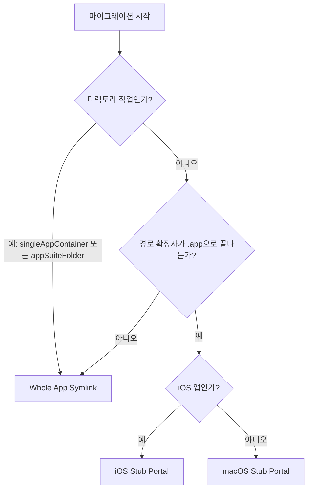

# 마이그레이션 전략

## 앱 컨테이너 분류

AppPorts는 마이그레이션 전에 앱을 분류하여 마이그레이션 세분화 수준을 결정합니다:

| 분류 | 정의 | 예시 |
|------|------|------|
| `standaloneApp` | 최상위 디렉토리에 단일 `.app` 패키지 | Safari, Finder |
| `singleAppContainer` | 1개의 `.app` 패키지만 포함하는 디렉토리 | 일부 서드파티 앱 설치 디렉토리 |
| `appSuiteFolder` | 2개 이상의 `.app` 패키지를 포함하는 디렉토리 | Microsoft Office, Adobe Creative Cloud |

분류 결과는 마이그레이션 전략 선택에 영향을 미침 — `singleAppContainer`와 `appSuiteFolder`는 내부의 개별 `.app` 파일을 처리하는 대신 전체 디렉토리를 단위로 마이그레이션합니다.

## 세 가지 마이그레이션 전략

AppPorts는 마이그레이션 후 앱을 로컬에서 계속 실행 가능하게 유지하기 위해 세 가지 로컬 엔트리(Portal) 전략을 정의합니다:

### Whole App Symlink

전체 `.app` 디렉토리(또는 디렉토리)를 외장 저장소를 가리키는 심볼릭 링크로 생성합니다.

```text
/Applications/SomeApp.app → /Volumes/External/SomeApp.app
```

**사용 사례:**

- 앱 컨테이너 분류가 `singleAppContainer` 또는 `appSuiteFolder`인 경우 (디렉토리 작업)
- `.app`이 아닌 경로 확장자를 가진 비표준 앱

**특징:** Finder에 아이콘에 화살표 바로가기 표시가 나타남.

### Deep Contents Wrapper (Contents 디렉토리 마이그레이션)

로컬에 실제 `.app` 디렉토리를 생성하고, `Contents/` 하위 디렉토리만 심볼릭 링크로 외장 저장소를 가리킵니다.

```text
/Applications/SomeApp.app/
└── Contents → /Volumes/External/SomeApp.app/Contents  (symlink)
```

**현재 상태:** 더 이상 사용되지 않음. 새로운 마이그레이션은 이 전략을 사용하지 않으며, 이전 버전으로 마이그레이션된 앱을 복원할 때만 인식하고 처리합니다.

**폐기 이유:** 자체 업데이트 프로그램이 `Contents/` 심볼릭 링크를 따라 외장 저장소 파일을 직접 조작하여 애플리케이션을 손상시킬 수 있음.

### Stub Portal

로컬에 최소한의 `.app` 셸을 생성하고, 런처 스크립트를 통해 `open` 명령으로 외장 저장소의 실제 앱을 호출합니다.

```text
/Applications/SomeApp.app/
├── Contents/
│   ├── MacOS/launcher          # 네이티브 바이너리 런처 (또는 bash 스크립트)
│   ├── Resources/AppIcon.icns  # 실제 앱에서 복사한 아이콘
│   ├── Info.plist              # 간소화된 설정 파일
│   ├── PkgInfo                 # 표준 식별자 파일
│   └── real_app_path.txt       # 외부 실제 앱 경로 저장
```

**사용 사례:** `.app` 확장자를 가진 모든 앱 (기본 전략).

**특징:** 로컬에 심볼릭 링크가 없음; Finder에 화살표 표시가 나타나지 않음; 자동 업데이트 프로그램이 침투할 수 없음.

#### macOS Stub Portal

네이티브 macOS 앱의 경우:

1. `Contents/MacOS/launcher` 런처 생성 (네이티브 바이너리 런처 또는 `open "<외부 앱 경로>"` bash 스크립트), `Contents/real_app_path.txt`에 외부 실제 앱 경로 저장
2. 외부 앱에서 `PkgInfo`와 아이콘 파일 복사
3. 외부 앱의 `Info.plist`에서 간소화된 `Info.plist` 생성:
   - `CFBundleExecutable`을 `launcher`로 설정
   - `LSUIElement`을 `true`로 설정 (Dock에 표시 안 함)
   - Sparkle/Electron 관련 설정 키 제거
   - Bundle ID에 `.appports.stub` 접미사 추가
4. Ad-hoc 코드 서명 실행

#### iOS Stub Portal

iOS 앱(Mac에서 실행되는 iOS 앱)의 경우, macOS 버전과의 차이점:

- 아이콘을 `Wrapper/` 또는 `WrappedBundle/` 디렉토리의 `.app` 패키지에서 추출
- `sips`를 사용하여 PNG를 256×256으로 크기 조정 후 `.icns` 형식으로 변환
- `Info.plist`를 `iTunesMetadata.plist`에서 생성 (iOS 앱은 표준 `Info.plist`를 포함하지 않음)
- 코드 서명 없음; 확장 속성만 정리 (`xattr -cr`)

## 전략 선택 결정 트리



::: tip Deep Contents Wrapper에 관하여
이 전략은 현재 버전에서 새로운 마이그레이션에 더 이상 선택되지 않습니다. `preferredPortalKind()` 메서드는 모든 `.app` 앱에 대해 `stubPortal`을 반환합니다. Deep Contents Wrapper는 이전 버전으로 마이그레이션된 앱을 복원할 때만 레거시 방식으로 인식됩니다.
:::
