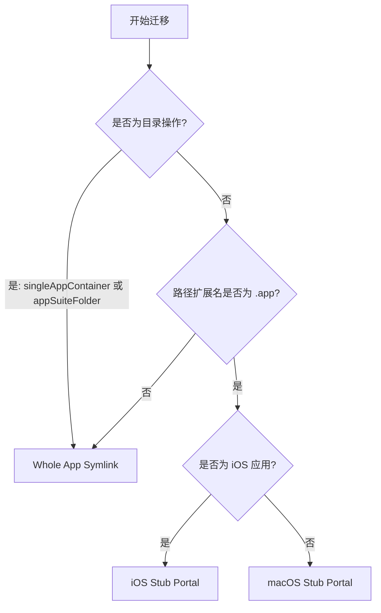

# 迁移策略

## 应用容器分类

AppPorts 在迁移前会对应用进行分类，以确定迁移粒度：

| 分类 | 定义 | 示例 |
|------|------|------|
| `standaloneApp` | 顶层目录中的单个 `.app` 包 | Safari、Finder |
| `singleAppContainer` | 目录中仅包含 1 个 `.app` 包 | 部分第三方应用的安装目录 |
| `appSuiteFolder` | 目录中包含 2 个及以上 `.app` 包 | Microsoft Office、Adobe Creative Cloud |

分类结果影响迁移策略的选择——`singleAppContainer` 和 `appSuiteFolder` 以整个目录为单位迁移，而非单独处理其中的 `.app` 文件。

## 三种迁移策略

AppPorts 定义了三种本地入口（Portal）策略，用于在迁移后保持应用可从本地启动：

### Whole App Symlink（整体符号链接）

将整个 `.app` 目录（或目录）创建为指向外部存储的符号链接。

```text
/Applications/SomeApp.app → /Volumes/External/SomeApp.app
```

**适用场景：**

- 应用容器分类为 `singleAppContainer` 或 `appSuiteFolder`（目录操作）
- 路径扩展名不为 `.app` 的非标准应用

**特征：** Finder 图标会显示箭头快捷方式标记。

### Deep Contents Wrapper（Contents 目录迁移）

在本地创建真实的 `.app` 目录，仅将 `Contents/` 子目录符号链接到外部存储。

```text
/Applications/SomeApp.app/
└── Contents → /Volumes/External/SomeApp.app/Contents  （符号链接）
```

**当前状态：** 已弃用。新迁移不再使用此策略，仅在还原旧版迁移的应用时进行识别和处理。

**弃用原因：** 自更新程序运行时会沿 `Contents/` 符号链接直接操作外部存储上的文件，可能导致应用本体被破坏。

### Stub Portal（壳门方案）

在本地创建最小化的 `.app` 壳，通过启动器调用 `open` 命令打开外部存储上的真实应用。

```text
/Applications/SomeApp.app/
├── Contents/
│   ├── MacOS/launcher                    # 原生二进制启动器（或 bash 脚本）
│   ├── Resources/real_app_path.txt       # 外部真实应用路径
│   ├── Resources/AppIcon.icns            # 从真实应用复制的图标
│   ├── Info.plist                        # 精简生成的配置文件
│   └── PkgInfo                           # 标准标识文件
```

**适用场景：** 所有 `.app` 扩展名的应用（默认策略）。

**特征：** 本地不包含任何符号链接，Finder 不显示箭头标记，自更新程序无法穿透。

#### macOS Stub Portal

适用于原生 macOS 应用，流程如下：

1. 创建 `Contents/MacOS/launcher` 原生二进制启动器，并在 `Contents/Resources/real_app_path.txt` 中写入外部应用路径
2. 从外部应用复制 `PkgInfo` 和图标文件
3. 基于外部应用的 `Info.plist` 生成精简版本：
   - `CFBundleExecutable` 设为 `launcher`
   - `LSUIElement` 设为 `true`（不在 Dock 显示）
   - 移除 Sparkle/Electron 相关配置键
   - Bundle ID 追加 `.appports.stub` 后缀
4. 执行 Ad-hoc 代码签名

#### iOS Stub Portal

适用于 iOS 应用（在 Mac 上运行的 iOS 应用），与 macOS 版本的差异：

- 图标从 `Wrapper/` 或 `WrappedBundle/` 目录内的 `.app` 包中提取
- 使用 `sips` 将 PNG 缩放至 256×256 并转换为 `.icns` 格式
- `Info.plist` 从 `iTunesMetadata.plist` 生成（iOS 应用不包含标准 `Info.plist`）
- 不执行代码签名，仅清理扩展属性（`xattr -cr`）

## 策略选择决策树



::: tip 关于 Deep Contents Wrapper
该策略在当前版本中已不再被选为新迁移方案。`preferredPortalKind()` 方法对所有 `.app` 应用统一返回 `stubPortal`。Deep Contents Wrapper 仅在还原历史迁移时作为遗留方案被识别。
:::
