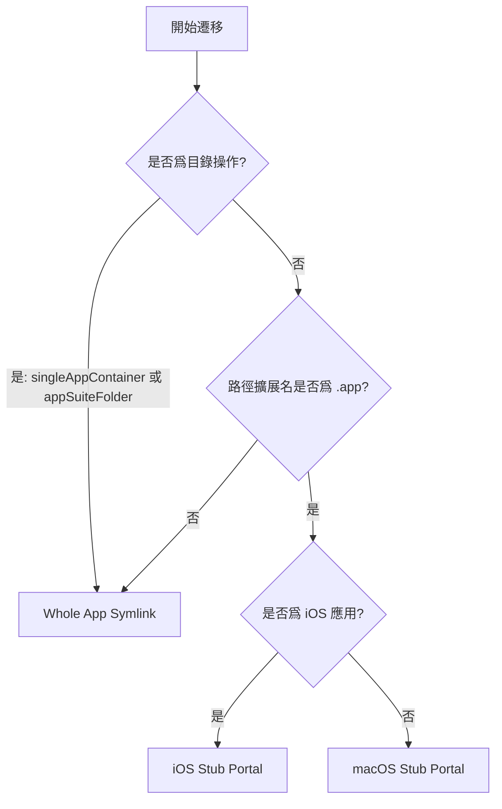

# 遷移策略

## 應用容器分類

AppPorts 在遷移前會對應用進行分類，以確定遷移粒度：

| 分類 | 定義 | 示例 |
|------|------|------|
| `standaloneApp` | 頂層目錄中的單個 `.app` 包 | Safari、Finder |
| `singleAppContainer` | 目錄中僅包含 1 個 `.app` 包 | 部分第三方應用的安裝目錄 |
| `appSuiteFolder` | 目錄中包含 2 個及以上 `.app` 包 | Microsoft Office、Adobe Creative Cloud |

分類結果影響遷移策略的選擇——`singleAppContainer` 和 `appSuiteFolder` 以整個目錄爲單位遷移，而非單獨處理其中的 `.app` 文件。

## 三種遷移策略

AppPorts 定義了三種本地入口（Portal）策略，用於在遷移後保持應用可從本地啓動：

### Whole App Symlink（整體符號鏈接）

將整個 `.app` 目錄（或目錄）創建爲指向外部存儲的符號鏈接。

```text
/Applications/SomeApp.app → /Volumes/External/SomeApp.app
```

**適用場景：**

- 應用容器分類爲 `singleAppContainer` 或 `appSuiteFolder`（目錄操作）
- 路徑擴展名不爲 `.app` 的非標準應用

**特徵：** Finder 圖標會顯示箭頭快捷方式標記。

### Deep Contents Wrapper（Contents 目錄遷移）

在本地創建真實的 `.app` 目錄，僅將 `Contents/` 子目錄符號鏈接到外部存儲。

```text
/Applications/SomeApp.app/
└── Contents → /Volumes/External/SomeApp.app/Contents  （符號鏈接）
```

**當前狀態：** 已棄用。新遷移不再使用此策略，僅在還原舊版遷移的應用時進行識別和處理。

**棄用原因：** 自更新程序運行時會沿 `Contents/` 符號鏈接直接操作外部存儲上的文件，可能導致應用本體被破壞。

### Stub Portal（殼門方案）

在本地創建最小化的 `.app` 殼，通過啓動器調用 `open` 命令打開外部存儲上的真實應用。

```text
/Applications/SomeApp.app/
├── Contents/
│   ├── MacOS/launcher                    # 原生二進制啓動器（或 bash 腳本）
│   ├── Resources/real_app_path.txt       # 外部真實應用路徑
│   ├── Resources/AppIcon.icns            # 從真實應用複製的圖標
│   ├── Info.plist                        # 精簡生成的配置文件
│   └── PkgInfo                           # 標準標識文件
```

**適用場景：** 所有 `.app` 擴展名的應用（默認策略）。

**特徵：** 本地不包含任何符號鏈接，Finder 不顯示箭頭標記，自更新程序無法穿透。

#### macOS Stub Portal

適用於原生 macOS 應用，流程如下：

1. 創建 `Contents/MacOS/launcher` 原生二進制啓動器，並在 `Contents/Resources/real_app_path.txt` 中寫入外部應用路徑
2. 從外部應用複製 `PkgInfo` 和圖標文件
3. 基於外部應用的 `Info.plist` 生成精簡版本：
   - `CFBundleExecutable` 設爲 `launcher`
   - `LSUIElement` 設爲 `true`（不在 Dock 顯示）
   - 移除 Sparkle/Electron 相關配置鍵
   - Bundle ID 追加 `.appports.stub` 後綴
4. 執行 Ad-hoc 代碼簽名

#### iOS Stub Portal

適用於 iOS 應用（在 Mac 上運行的 iOS 應用），與 macOS 版本的差異：

- 圖標從 `Wrapper/` 或 `WrappedBundle/` 目錄內的 `.app` 包中提取
- 使用 `sips` 將 PNG 縮放至 256×256 並轉換爲 `.icns` 格式
- `Info.plist` 從 `iTunesMetadata.plist` 生成（iOS 應用不包含標準 `Info.plist`）
- 不執行代碼簽名，僅清理擴展屬性（`xattr -cr`）

## 策略選擇決策樹



::: tip 關於 Deep Contents Wrapper
該策略在當前版本中已不再被選爲新遷移方案。`preferredPortalKind()` 方法對所有 `.app` 應用統一返回 `stubPortal`。Deep Contents Wrapper 僅在還原歷史遷移時作爲遺留方案被識別。
:::
