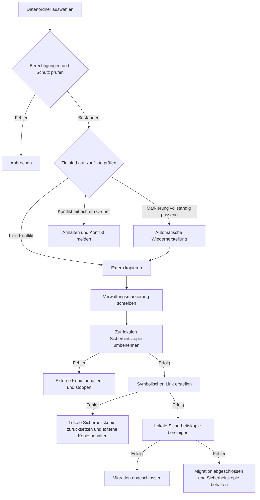

# Grundlagen der Datenmigration


AppPorts verschiebt zu Apps gehörende Datenordner auf ein externes Laufwerk und gibt lokalen Speicher frei. Je nach Speicherort verwendet es zwei Verfahren:

| Ordner | Verfahren | Grund |
|------|------|------|
| `~/Library/Containers/`, `~/Library/Group Containers/` | Mount-Migration | Die Sandbox prüft den aufgelösten tatsächlichen Pfad und verweigert symbolische Links nach außerhalb des Containers |
| Andere Unterordner von `~/Library/`, Tool-Verzeichnisse und eigene Ordner | Symbolischer Link | Keine Sandbox-Beschränkung; einfachste Lösung |

Diese Seite erklärt symbolische Links. Das andere Verfahren steht unter [Mount-Migration](mount-migration.md).

## Verfahren mit symbolischen Links <a href="#verfahren-mit-symbolischen-links" id="verfahren-mit-symbolischen-links"></a>

1. Den lokalen Ordner vollständig extern kopieren.
2. Die Verwaltungsmarkierung `.appports-link-metadata.plist` im externen Ordner schreiben.
3. Den ursprünglichen lokalen Ordner als versteckte Sicherheitskopie auf demselben Volume umbenennen.
4. Am ursprünglichen Pfad einen symbolischen Link zur externen Kopie erstellen.
5. Nach erfolgreicher Linkerstellung die Sicherheitskopie bereinigen.

```
~/Library/Application Support/SomeApp
    → /Volumes/External/AppPortsData/SomeApp  （符号链接）
```



## Verwaltungsmarkierung <a href="#verwaltungsmarkierung" id="verwaltungsmarkierung"></a>

`.appports-link-metadata.plist` im externen Ordner kennzeichnet ihn als von AppPorts verwaltet:

| Feld | Beschreibung |
|------|------|
| `schemaVersion` | Version, derzeit 1 |
| `managedBy` | `com.shimoko.AppPorts` |
| `sourcePath` | Ursprünglicher lokaler Pfad |
| `destinationPath` | Externer Zielpfad |
| `dataDirType` | Datenordnertyp |

Beim Scannen unterscheidet die Markierung AppPorts-Links von manuell erstellten Links. Nach einer Unterbrechung ermöglicht sie die automatische Fortsetzung. Nur wenn alle fünf Felder übereinstimmen, gilt der Ordner als fortsetzbar. Andernfalls liegt ein Konflikt vor. Ähnliche Ordnergrößen sind kein Grund, Daten zu übernehmen oder zu überschreiben.

Erneutes Verlinken und Normalisieren gelten nur für Ordner. Normale externe Dateien werden nicht als Ordner erneut verlinkt.

## Unterstützte Datenordnertypen <a href="#unterstutzte-datenordnertypen" id="unterstutzte-datenordnertypen"></a>

| Typ | Pfad | Verfahren |
|------|------|------|
| `applicationSupport` | `~/Library/Application Support/` | Symbolischer Link |
| `preferences` | `~/Library/Preferences/` | Symbolischer Link |
| `containers` | `~/Library/Containers/` | Einbinden |
| `groupContainers` | `~/Library/Group Containers/` | Einbinden |
| `caches` | `~/Library/Caches/` | Symbolischer Link |
| `webKit` | `~/Library/WebKit/` | Symbolischer Link |
| `httpStorages` | `~/Library/HTTPStorages/` | Symbolischer Link |
| `applicationScripts` | `~/Library/Application Scripts/` | Symbolischer Link |
| `logs` | `~/Library/Logs/` | Symbolischer Link |
| `savedState` | `~/Library/Saved Application State/` | Symbolischer Link |
| `dotFolder` | `~/.npm`, `~/.vscode` usw. | Symbolischer Link |
| `custom` | Eigener Pfad | Symbolischer Link |

## Wiederherstellung <a href="#wiederherstellung" id="wiederherstellung"></a>

1. Prüfen, dass der lokale Pfad ein symbolischer Link zu einem gültigen externen Ordner ist.
2. Den externen Ordner in einen lokalen Zwischenordner kopieren.
3. Den Link entfernen und den Zwischenordner auf den ursprünglichen Pfad umbenennen.
4. Den externen Ordner nach Möglichkeit entfernen.

Scheitert das Kopieren, bleibt der Link unverändert. Scheitert das Umbenennen, wird der Link wiederhergestellt und der Zwischenordner für die manuelle Wiederherstellung bewahrt.

## Fehlerbehandlung und Rückabwicklung <a href="#fehlerbehandlung-und-ruckabwicklung" id="fehlerbehandlung-und-ruckabwicklung"></a>

- **Kopieren fehlgeschlagen:** Bereits kopierte externe Dateien bereinigen und keine weiteren Schritte ausführen.
- **Zielkonflikt:** Ein echter externer Ordner ohne passende Markierung bleibt zusammen mit den lokalen Daten erhalten; der Vorgang stoppt.
- **Umbenennen zur Sicherheitskopie fehlgeschlagen:** Anhalten und externe Kopie behalten; lokale Quelle nicht verändern.
- **Linkerstellung fehlgeschlagen:** Sicherheitskopie an den ursprünglichen Pfad zurücksetzen und externe Kopie bewahren.
- **Bereinigung der Sicherheitskopie fehlgeschlagen:** Die Migration gilt als abgeschlossen. `.appports-migration-backup-*` bleibt lokal und kann nach Prüfung manuell entfernt werden.
