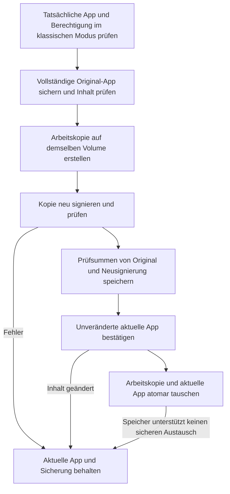

# Neusignierung und Schutz vor Abstürzen


**Neusignierung ist keine allgemeine Reparatur**

Ad-hoc-Neusignierung ersetzt die Entwicklersignatur und entfernt Rechte für Sandbox, App-Gruppen und Schlüsselbund. Sandbox-Apps wie WeChat oder App Store-Apps können dadurch unter macOS 27 nicht mehr öffnen oder ihre Anmeldesitzung verlieren. Die neue Version speichert zuerst die vollständige Original-App, damit Signatur und ursprüngliche Rechte später wiederhergestellt werden können. Bereits verlorene Anmeldesitzungen kehren mit der Signatur nicht garantiert zurück.

Seit 1.9.0 lehnt AppPorts die Neusignierung von Sandbox-Apps standardmäßig ab. Sie ist nur im klassischen Modus nach Risikobestätigung erlaubt. Containerdaten verwenden [Mount-Migration](mount-migration.md) ohne Signaturänderung. Hintergründe: [Containerdaten, Sandbox und Signaturidentität](container-identity.md).


## Welches Problem löst Neusignierung? 

macOS prüft die Integrität von App-Paketen anhand ihrer Codesignatur. Nach dem Auslagern der App mit einer lokalen Startapp kann das System die App unter bestimmten Umständen für verändert halten und mit „beschädigt“ oder „nicht verifizierter Entwickler“ den Start verweigern. Eine Ad-hoc-Neusignierung der **tatsächlichen App auf dem externen Laufwerk** kann dann die Prüfung ermöglichen.

Das ist der einzige Zweck. Mit der Migration von Datenordnern hat es nichts zu tun. Dass frühere Versionen beides bei Containerdaten verknüpften, verursachte die Probleme unter macOS 27.

## Wann du es nicht verwenden solltest 

| Situation | Erklärung |
|------|------|
| Sandbox-App | Standardmäßig abgelehnt; nach Risikobestätigung im klassischen Modus erlaubt. Mount-Migration ist vorzuziehen |
| App Store-App | Durch SIP geschützt; nicht signierbar |
| App mit Anmeldedaten im Schlüsselbund | Anmeldesitzung geht durch Neusignierung verloren |
| App mit Widgets oder Teilen-Erweiterungen | App-Gruppenrechte gehen verloren; Erweiterungen können gemeinsame Daten nicht lesen |
| App öffnet sich normal | Ohne Problem nicht neu signieren |

Erwäge es nur, wenn nach der externen Migration tatsächlich „beschädigt“ erscheint. Versuche zuerst eine Neuinstallation oder einen erneuten Download von der offiziellen Website.

## Zugänge und Schalter 

| Aktion | Ort | Standard | Verhalten |
|------|------|------|------|
| Diese App neu signieren | Kontextmenü der App-Liste | Manuell | Vollständige Sicherung, dann Signieren einer Arbeitskopie. Sandbox-Apps werden standardmäßig abgelehnt; klassischer Modus benötigt Bestätigung |
| Nach Migration neu signieren | Symbolleiste der Datenverzeichnisse, nur im klassischen Modus sichtbar | Aus | Zugehörige App nach Migration über symbolische Links neu signieren |
| Automatische Neuzeichnung bei Anmeldung | Einstellungen | Bei Neuinstallation aus | Nur alte Datensätze bearbeiten; neue mit vollständigem Snapshot überspringen, damit die Signaturtransaktion nicht umgangen wird |
| Originalsignatur wiederherstellen | App-Kontextmenü, Datenseiten-Symbolleiste, Reparaturfenster | Manuell | Original-App aus vollständiger Sicherung zurückholen. Alte Datensätze benötigen eine offizielle Original-App derselben Version. Kein privater Entwicklerschlüssel nötig |

Für die Sandbox-Prüfung werden die Rechte der **tatsächlichen App** gelesen, nicht die der lokalen Startapp. Bei `com.apple.security.app-sandbox` mit true wird abgelehnt. Im [klassischen Datenmigrationsmodus](../settings.md#classic-data-migration-mode) ist es mit einer zusätzlichen Bestätigung bei jedem Vorgang erlaubt.

## Signaturablauf 

Eine lokale Startapp wird zuerst zur tatsächlichen App aufgelöst. Signierung und Wiederherstellung wirken auf die echte `.app`, ohne die Startapp zu überschreiben. Scheitert das Signieren oder Prüfen der Arbeitskopie, bleibt die aktuelle App unverändert. Auch ihre bisherigen Sperrflags bleiben erhalten.

## Signatur sichern und wiederherstellen 

**Eine vollständige Sicherung kann die Signatur eines Drittentwicklers ohne dessen privaten Schlüssel wiederherstellen.** Die ursprüngliche Signatur ist bereits in den App-Dateien enthalten. Wiederherstellung bedeutet, diese Dateien zurückzuholen, nicht erneut mit der Entwickleridentität zu signieren. Hauptprogramm, verschachtelte Hilfsprogramme, Frameworks, Signaturressourcen und ursprüngliche Rechte werden mitgesichert. Ursprünglich Ad-hoc-signierte oder unsignierte Apps werden ebenfalls in ihren jeweiligen Originalzustand zurückversetzt.

Unter `~/Library/Application Support/AppPorts/signature-backups/` liegen die `.plist`-Datensätze pro App-Kennung und die Originalkopien `original-…app`. Das Datensatzformat Version 2 speichert Prüfsummen des ursprünglichen und des neu signierten Inhalts. Wo das Dateisystem es erlaubt, wird Copy-on-Write verwendet; sonst ist eine vollständige Kopie nötig. Halte daher Platz für Sicherung und Arbeitskopie frei. Bei Platzmangel oder Kopierfehlern wird das Signieren abgebrochen.

Wiederherstellung:

1. App beenden.
2. Falls Containerdaten im klassischen Modus migriert wurden, zuerst die entsprechenden Ordner unter „App Data“ wiederherstellen. Nach Rückkehr der Sandbox-Identität kann die App keine externen Containerdaten über symbolische Links lesen. AppPorts prüft dies und verhindert das Überspringen.
3. Im App-Kontextmenü, der Datenseiten-Symbolleiste oder dem Reparaturfenster „Originalsignatur wiederherstellen“ wählen.
4. AppPorts prüft die Sicherung und mögliche Änderungen oder Updates der aktuellen App. Nach Prüfung der Originalsignatur in einer Arbeitskopie wird die aktuelle App sicher ersetzt. Danach wird die Sicherung bereinigt.

**Bei App-Updates, Inhaltsänderungen oder beschädigten Sicherungen stoppt die Wiederherstellung und bewahrt App und Sicherung.** Eine alte App überschreibt keine neue, und neue Signierergebnisse werden nicht mit alten Sicherungen vermischt. Unterstützt der Speicher keinen atomaren Austausch, hole die App vor Signaturoperationen lokal zurück. Normales Scannen entfernt Wiederherstellungsmaterial nicht automatisch.

Nach einem offiziellen Update oder einer Neuinstallation wird beim nächsten Signieren eine neue vollständige Sicherung angelegt, sofern die App die strenge Signaturprüfung besteht und die Entwickleridentität zum Datensatz passt. Der alte Datensatz wird unter `signature-backups/retired/` archiviert; auch seine ursprüngliche App-Kopie bleibt erhalten und wird nicht für die neue Version verwendet. Archive belegen weiterhin Speicher. Wenn die alte Version nicht mehr benötigt wird, findest du die zugehörige Kopie über `snapshotName` im archivierten Datensatz und kannst sie bereinigen.

### Was ist mit alten Sicherungen, die nur einen Identitätsnamen enthalten? 

Alte `.plist`-Dateien enthalten nur App-Kennung, Signaturidentitätsname, Pfad und Datum, aber kein Originalprogramm und keine Berechtigungsdaten. Daraus lässt sich keine Signatur wiederherstellen. Weder das frühere Entfernen der Signatur bei Ad-hoc-Datensätzen noch das Signieren anhand eines Identitätsnamens war eine echte Wiederherstellung.

Die neue Version bewahrt diese Datensätze und bietet „Original-App auswählen…“. Beschaffe eine offizielle Original-`.app` **derselben App und Version**. AppPorts prüft Bundle ID, Version und Signatur sowie die Entwickleridentität, falls sie im alten Datensatz enthalten ist. Danach wird das Original am aktuellen tatsächlichen App-Pfad wiederhergestellt. Die lokale Startapp bleibt gültig, und das ausgewählte Original wird nicht verändert.

Findest du keine Original-App derselben Version, folge der [Reparatur](../macos-27.md#reparatur): Daten wiederherstellen, App lokal zurückholen und aus offizieller Quelle neu installieren. Der alte Datensatz allein kann keine verlorene Signatur neu erzeugen.

## Weitere Risiken nach App-Typ 

Diese stehen nicht direkt mit der Neusignierung in Verbindung, werden aber oft zusammen gefragt:

| App-Typ | Risiko | Erklärung |
|----------|------|------|
| Sparkle / Electron mit Selbstaktualisierung | Hoch | Updater können die externe App löschen oder ersetzen. Verwende „Gesperrte Migration“ |
| Chrome / Edge | Mittel | Updates landen lokal. „Ausstehende Auslagerung“ weist auf eine erneute Migration hin |
| App Store-Apps | Hoch | Nicht signierbar; ab macOS 15.1 wird die native externe Installation des App Store empfohlen |

Siehe [Selbstaktualisierende Apps erkennen](../migration-strategy/updater-detection.md) und [App-Typen und Strategien](../migration-strategy/strategy-map.md).
