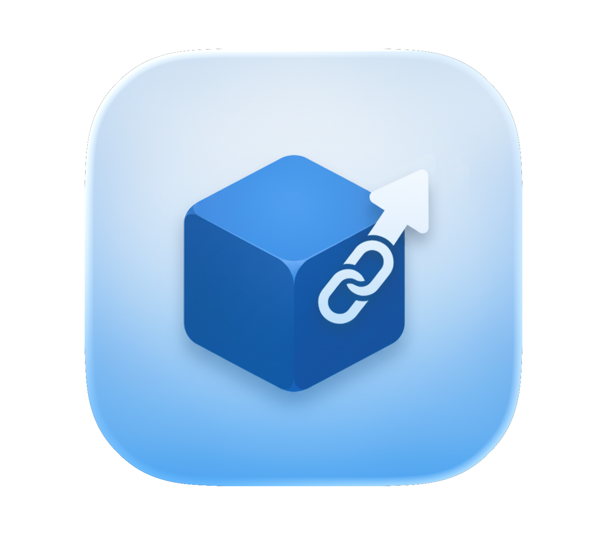

# AppPorts

<figure><figcaption></figcaption></figure>

## App Migration Tool 

App migration tool designed for macOS

<a href="faststart.md" class="button primary">Get Started</a>

<a href="AppPorts.md" class="button secondary">Introduction</a>

<table data-view="cards"><thead><tr><th></th><th></th></tr></thead><tbody>

<tr><td><strong>🔄 Badge-free Migration</strong></td><td>One-click migration of large apps to external drives. No shortcut arrows in Finder; Launchpad and app menu work normally.</td></tr>

<tr><td><strong>🔒 Auto-Update Protection</strong></td><td>Automatically detects self-updating apps such as Sparkle and Electron apps and offers Locked Migration. A newer local app is marked Pending Move Out when the external copy is older.</td></tr>

<tr><td><strong>📦 Data Directory Management</strong></td><td>Move ~/Library/ subdirectories, ~/.npm and other data directories to external storage. Sandbox container data, such as WeChat chat history, uses mount migration to an APFS external drive, leaving the signature unchanged.</td></tr>

</tbody></table>
