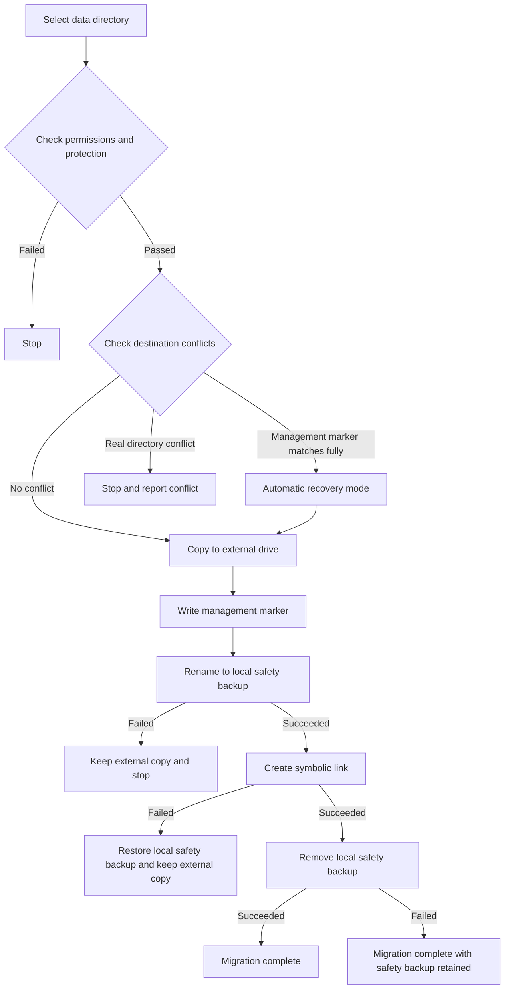

# How Data Migration Works


AppPorts moves an app's associated data directories to an external drive to free up local space. It uses two strategies, depending on the directory's location:

| Directory | Strategy | Reason |
|-----------|----------|--------|
| `~/Library/Containers/`, `~/Library/Group Containers/` | Mount migration | The sandbox checks the resolved path and rejects symbolic links that lead outside the container |
| Other `~/Library/` subdirectories, tool directories, and custom folders | Symbolic links | These are not restricted by the sandbox, so symbolic links are the simplest approach |

This page covers symbolic links. For the other strategy, see [Mount Migration](mount-migration.md).

## Symbolic-Link Strategy <a href="#symbolic-link-strategy" id="symbolic-link-strategy"></a>

1. Copy the entire local directory to the external drive.
2. Write the management marker `.appports-link-metadata.plist` to the external directory.
3. Rename the original local directory to a hidden safety backup on the same volume.
4. Create a symbolic link at the original path, pointing to the external copy.
5. Remove the safety backup after the link is created successfully.

```
~/Library/Application Support/SomeApp
    → /Volumes/External/AppPortsData/SomeApp  （符号链接）
```



## Management Marker <a href="#management-marker" id="management-marker"></a>

The `.appports-link-metadata.plist` file in the external directory identifies it as managed by AppPorts:

| Field | Description |
|-------|-------------|
| `schemaVersion` | Format version, currently 1 |
| `managedBy` | `com.shimoko.AppPorts` |
| `sourcePath` | Original local path |
| `destinationPath` | External destination path |
| `dataDirType` | Data directory type |

The scanner uses this marker to distinguish AppPorts links from user-created links, and to resume interrupted migrations automatically. Matching is strict: all five fields must agree before a managed directory can be reused. Otherwise it is treated as a conflict. Similar directory sizes are never sufficient reason to take over or overwrite data.

Relinking and normalization work only with directories. AppPorts will not relink a regular external file as if it were a directory.

## Supported Data Directory Types <a href="#supported-data-directory-types" id="supported-data-directory-types"></a>

| Type | Path | Strategy |
|------|------|----------|
| `applicationSupport` | `~/Library/Application Support/` | Symbolic link |
| `preferences` | `~/Library/Preferences/` | Symbolic link |
| `containers` | `~/Library/Containers/` | Mount |
| `groupContainers` | `~/Library/Group Containers/` | Mount |
| `caches` | `~/Library/Caches/` | Symbolic link |
| `webKit` | `~/Library/WebKit/` | Symbolic link |
| `httpStorages` | `~/Library/HTTPStorages/` | Symbolic link |
| `applicationScripts` | `~/Library/Application Scripts/` | Symbolic link |
| `logs` | `~/Library/Logs/` | Symbolic link |
| `savedState` | `~/Library/Saved Application State/` | Symbolic link |
| `dotFolder` | `~/.npm`, `~/.vscode`, etc. | Symbolic link |
| `custom` | User-selected path | Symbolic link |

## Restore Process <a href="#restore-process" id="restore-process"></a>

1. Confirm that the local path is a symbolic link pointing to a valid external directory.
2. Copy the external directory to a local staging directory.
3. Delete the symbolic link and rename the staging directory to the original path.
4. Delete the external directory on a best-effort basis.

If copying fails, the symbolic link is left unchanged. If renaming fails, the link is recreated and the staging directory is kept for manual recovery.

## Error Handling and Rollback <a href="#error-handling-and-rollback" id="error-handling-and-rollback"></a>

- **Copy fails**: Remove the external files copied so far and perform no further steps.
- **Destination conflict**: If a real external directory already exists and its marker does not match, stop and preserve both copies.
- **Renaming to the safety backup fails**: Stop and keep the external copy; leave the local source unchanged.
- **Creating the symbolic link fails**: Restore the safety backup to its original path and keep the external copy.
- **Removing the safety backup fails**: Migration is complete, but a local `.appports-migration-backup-*` remains. You can remove it manually after verifying the result.
