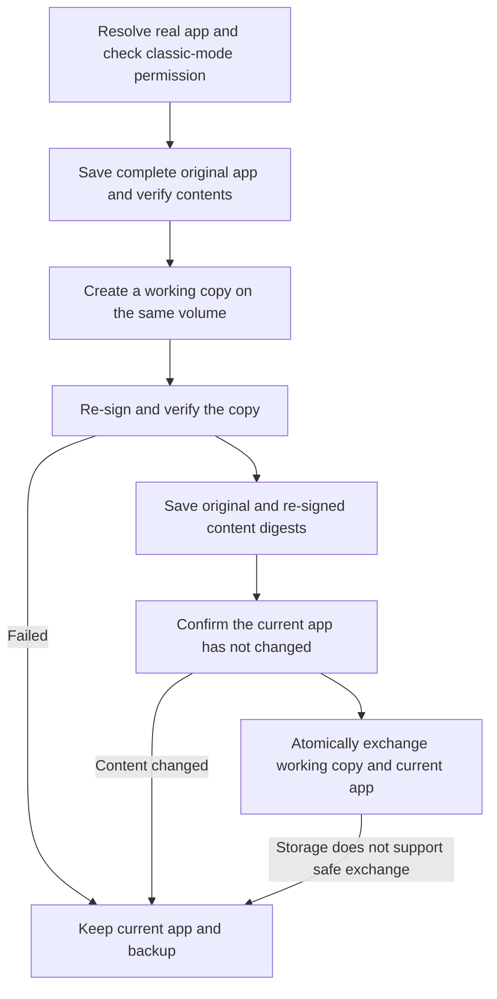

# Re-signing and Crash Prevention


**Re-signing is not a general repair tool**

Ad-hoc re-signing replaces the developer signature and removes sandbox, app group, and Keychain entitlements. For sandboxed apps such as WeChat and App Store apps, this can prevent opening on macOS 27 and may lose login sessions. The new version first saves a complete original app, allowing the signature and entitlements to be restored later. Restoring a signature does not guarantee recovery of login sessions already lost.

Starting with 1.9.0, AppPorts refuses to re-sign sandboxed apps by default. It is allowed only after enabling classic mode and confirming the risks. Container data now uses [mount migration](mount-migration.md), without signature changes. See [Container Data, Sandboxing, and Signing Identity](container-identity.md) for the background.


## What Re-signing Solves 

macOS uses code signatures to verify app bundle integrity. After the app itself is moved to an external drive and only a launcher remains locally, the system may sometimes treat it as modified, show "damaged" or "unidentified developer", and refuse to open it. Applying an Ad-hoc signature to the **real app on the external drive** can let it pass verification.

This is the purpose of re-signing. It is separate from data directory migration; coupling it to container migration in older versions caused the macOS 27 problem.

## When Not to Use It 

| Situation | Explanation |
|-----------|-------------|
| Sandboxed apps | Refused by default; classic mode allows it after risk confirmation, but mount migration is preferred |
| App Store apps | Protected by SIP and cannot be re-signed |
| Apps relying on Keychain login sessions | Re-signing loses those sessions |
| Apps with widgets or sharing extensions | App group entitlements are lost, preventing extensions from reading shared data |
| Apps that already open normally | Do not re-sign an app that has no problem |

Consider it only when a "damaged" message actually appears after migration to external storage, and try reinstalling or downloading a fresh copy from the official website first.

## Actions and Settings 

| Action | Location | Default | Behavior |
|--------|----------|---------|----------|
| Resign This App | App list right-click menu | Manual | Saves a complete backup, then signs a working copy. Refuses sandboxed apps by default; classic mode requires risk confirmation |
| Re-sign after migration | Data Directories toolbar, visible only in classic mode | Off | Re-signs the associated app after symbolic-link migration |
| Auto Re-sign at Login | Settings | Off for new installations | Handles legacy records only; skips new records with full snapshots to avoid bypassing the signing transaction |
| Restore Original Signature | App list right-click menu, data toolbar, or repair panel | Manual | Restores the original app from a full backup. Legacy records can use an official original copy of the same version. No developer private key is needed |

Sandbox detection reads the entitlements of the **real app**, not the local launcher. If `com.apple.security.app-sandbox` is true, signing is refused. [Classic Data Migration Mode](../settings.md#classic-data-migration-mode) allows it with a second confirmation every time.

## Signing Process 

Local launchers are resolved to the real app first. Signing and restoration operate on the real `.app` and do not overwrite its launcher. If signing or verification of the working copy fails, the current app stays unchanged. Its existing lock state is preserved too.

## Signature Backups and Restoration 

**A full backup can restore a third-party developer signature without the developer's private key.** The original signature is already contained in the app files. Restoration returns those files instead of signing again as the developer. The main executable, nested helpers, frameworks, signature resources, and original entitlements are saved together. Apps originally signed Ad-hoc or unsigned are also restored to their original states.

Backups are in `~/Library/Application Support/AppPorts/signature-backups/`, including an app-specific `.plist` record and an `original-…app` copy. Version 2 records store digests of both original and re-signed contents. Copy-on-write is preferred on supported file systems; otherwise a complete copy is needed. Leave enough space for the backup and working copy. Insufficient space or a copy failure aborts signing.

To restore:

1. Quit the app.
2. If container data was migrated in classic mode, restore the corresponding directories in "App Data" first. Once its sandbox identity is restored, the app cannot read data outside the container through symbolic links. AppPorts checks and prevents skipping this step.
3. Click "Restore Original Signature" in the app's right-click menu, data toolbar, or repair panel.
4. AppPorts validates the backup, checks whether the current app has changed or been updated, verifies the original signature in a working copy, then safely replaces the current app. It removes the backup after success.

**Restoration stops and preserves both the current app and backup if the app was updated, its contents changed, or the backup is damaged.** It will not overwrite a newer app with an older one or mix a newer re-signing result with an older backup. On storage without atomic exchange support, move the app back to this Mac before signing. Ordinary scans never delete recovery materials automatically.

After an official update or reinstall, if the current app passes strict signature verification and its developer identity matches the record, re-signing creates a new complete backup of the current app. The old record is archived under `signature-backups/retired/`, and its original app copy is preserved outside the new restoration workflow. Archived copies still consume disk space. Once you no longer need an older version, use its record's `snapshotName` to locate the corresponding copy before cleaning it up.

### What About Legacy Backups Containing Only an Identity Name? 

Old `.plist` files contain the app identifier, signing identity name, path, and timestamp, but not the original program or entitlements. They cannot restore a signature. The old behavior of treating an Ad-hoc record as "remove the signature", or signing again with an identity name, was not true restoration.

The new version preserves these records and offers "Choose Original App…". Obtain an official original `.app` for **the same app and version**. AppPorts verifies its Bundle ID, version, and signature; it also checks the developer identity if the old record includes one. Once validated, the original replaces the current real app, and the local launcher remains usable. The original copy you select is not modified.

If you cannot find the same version, follow the [repair steps](../macos-27.md#repair): restore data, move the app back to this Mac, and reinstall from an official source. An old identity record alone cannot recreate a lost signature.

## Related App-Type Risks 

These are separate from re-signing but are often asked about together:

| App Type | Risk | Explanation |
|----------|------|-------------|
| Self-updating Sparkle / Electron apps | High | The updater may delete or replace the external app. Use "Locked Migration" |
| Chrome / Edge | Medium | Updates install locally; AppPorts marks them "Pending Move Out" so you can migrate again |
| App Store apps | High | Cannot be re-signed. On macOS 15.1+, prefer the App Store's native external installation |

See [Self-Updating App Detection](../migration-strategy/updater-detection.md) and [App Types and Strategies](../migration-strategy/strategy-map.md).
