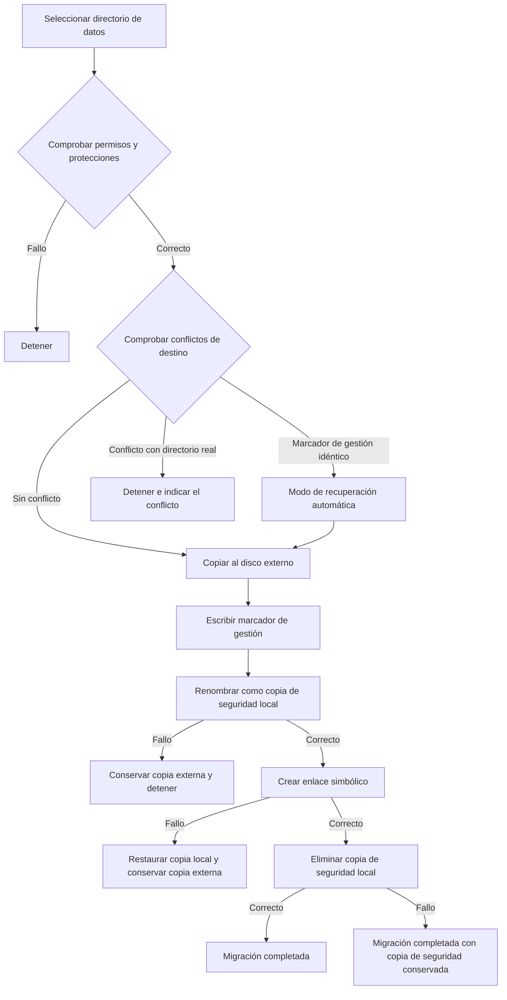

# Funcionamiento de la migración de datos


La migración de datos de AppPorts mueve los directorios asociados a las apps a un disco externo para liberar espacio local. Usa dos estrategias según su ubicación:

| Directorio | Estrategia | Motivo |
|------|------|------|
| `~/Library/Containers/`, `~/Library/Group Containers/` | Migración por montaje | El entorno aislado comprueba la ruta real resuelta y rechaza enlaces simbólicos que salen del contenedor |
| Otros subdirectorios de `~/Library/`, directorios de herramientas y carpetas personalizadas | Enlace simbólico | Es la opción más sencilla y no está sujeta a las restricciones del entorno aislado |

Esta página explica la estrategia de enlaces simbólicos. Para la otra estrategia, consulte [Migración por montaje](mount-migration.md).

## Estrategia de enlaces simbólicos <a href="#estrategia-de-enlaces-simbolicos" id="estrategia-de-enlaces-simbolicos"></a>

1. Copiar todo el directorio local al disco externo.
2. Escribir el marcador de gestión `.appports-link-metadata.plist` en el directorio externo.
3. Renombrar el directorio local original como copia de seguridad oculta en el mismo volumen.
4. Crear en la ruta original un enlace simbólico que apunte a la copia externa.
5. Eliminar la copia de seguridad cuando el enlace se haya creado correctamente.

```
~/Library/Application Support/SomeApp
    → /Volumes/External/AppPortsData/SomeApp  （符号链接）
```



## Marcador de gestión <a href="#marcador-de-gestion" id="marcador-de-gestion"></a>

El archivo `.appports-link-metadata.plist` del directorio externo indica que AppPorts lo gestiona:

| Campo | Descripción |
|------|------|
| `schemaVersion` | Número de versión, actualmente 1 |
| `managedBy` | `com.shimoko.AppPorts` |
| `sourcePath` | Ruta local original |
| `destinationPath` | Ruta de destino externa |
| `dataDirType` | Tipo de directorio de datos |

Durante el análisis, distingue los enlaces creados por AppPorts de los creados por el usuario. También permite reanudar una migración interrumpida. La coincidencia es estricta: los cinco campos deben ser idénticos para reanudar un directorio gestionado. Si no, se considera un conflicto. Un tamaño similar nunca basta para asumir su gestión ni sobrescribirlo.

El reenlace y la normalización solo se aplican a directorios. No se vuelve a enlazar un archivo externo normal como si fuera un directorio.

## Tipos de directorios de datos compatibles <a href="#tipos-de-directorios-de-datos-compatibles" id="tipos-de-directorios-de-datos-compatibles"></a>

| Tipo | Ruta | Estrategia |
|------|------|------|
| `applicationSupport` | `~/Library/Application Support/` | Enlace simbólico |
| `preferences` | `~/Library/Preferences/` | Enlace simbólico |
| `containers` | `~/Library/Containers/` | Montaje |
| `groupContainers` | `~/Library/Group Containers/` | Montaje |
| `caches` | `~/Library/Caches/` | Enlace simbólico |
| `webKit` | `~/Library/WebKit/` | Enlace simbólico |
| `httpStorages` | `~/Library/HTTPStorages/` | Enlace simbólico |
| `applicationScripts` | `~/Library/Application Scripts/` | Enlace simbólico |
| `logs` | `~/Library/Logs/` | Enlace simbólico |
| `savedState` | `~/Library/Saved Application State/` | Enlace simbólico |
| `dotFolder` | `~/.npm`, `~/.vscode`, etc. | Enlace simbólico |
| `custom` | Ruta definida por el usuario | Enlace simbólico |

## Proceso de restauración <a href="#proceso-de-restauracion" id="proceso-de-restauracion"></a>

1. Comprobar que la ruta local sea un enlace simbólico hacia un directorio externo válido.
2. Copiar el directorio externo a un directorio temporal local.
3. Eliminar el enlace simbólico y renombrar el directorio temporal con la ruta original.
4. Eliminar el directorio externo, si es posible.

Si falla la copia, el enlace simbólico no cambia. Si falla el cambio de nombre, se recrea el enlace y se conserva el directorio temporal para recuperarlo manualmente.

## Gestión de errores y reversión <a href="#gestion-de-errores-y-reversion" id="gestion-de-errores-y-reversion"></a>

- **Fallo de copia**: eliminar los archivos externos ya copiados y no continuar.
- **Conflicto de destino**: si existe un directorio real y su marcador no coincide, detenerse y conservar los datos de ambos lados.
- **Fallo al renombrar la copia de seguridad**: detenerse y conservar la copia externa, sin tocar el directorio de origen local.
- **Fallo al crear el enlace simbólico**: devolver la copia de seguridad a la ruta original y conservar también la copia externa.
- **Fallo al eliminar la copia de seguridad**: la migración se considera completada, pero queda la copia local `.appports-migration-backup-*`. Puede eliminarla manualmente después de comprobar los datos.
