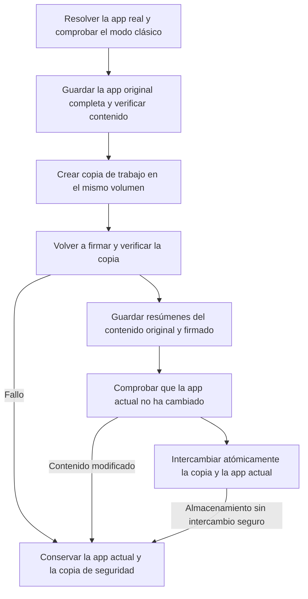

# Firma y prevención de cierres inesperados


**Volver a firmar no es una solución universal**

Volver a firmar con Ad-hoc sustituye la firma del desarrollador y elimina los derechos de aislamiento, grupos de apps y llavero. Una app aislada, como WeChat o una app de App Store, podría no abrirse en macOS 27 y perder su sesión. La nueva versión guarda primero la app original completa para restaurar su firma y derechos; restaurar la firma no garantiza recuperar una sesión que ya se haya perdido.

Desde la versión 1.9.0, AppPorts rechaza por defecto volver a firmar apps aisladas. Solo se permite al activar el modo clásico y confirmar los riesgos. Los datos de contenedores usan [migración por montaje](mount-migration.md), sin modificar la firma. Consulte [Datos de contenedores, aislamiento e identidad de firma](container-identity.md).


## Qué problema resuelve volver a firmar 

macOS comprueba la integridad de las apps mediante la firma de código. Tras mover la app al disco externo y dejar un lanzador local, a veces el sistema considera que se ha modificado y rechaza abrirla con un aviso de que está dañada o procede de un desarrollador no identificado. En ese caso, volver a firmar con Ad-hoc **la app real del disco externo** puede permitir que supere la comprobación.

Ese es su único propósito. No guarda relación con migrar directorios de datos; asociarlo a la migración de contenedores en versiones antiguas originó los problemas de macOS 27.

## Cuándo no usarlo 

| Situación | Explicación |
|------|------|
| App aislada | Se rechaza por defecto; el modo clásico lo permite tras confirmar los riesgos, pero se debe priorizar la migración por montaje |
| App de App Store | SIP la protege y no se puede volver a firmar |
| App cuya sesión depende del llavero | Volver a firmar hace perder la sesión |
| App con widgets o extensiones de compartir | La pérdida de derechos de grupos impide a las extensiones leer datos compartidos |
| App que se abre normalmente | Si no hay problema, no vuelva a firmarla |

Considérelo únicamente si aparece realmente un aviso de app dañada tras migrarla al disco externo. Pruebe antes a reinstalar o descargar de nuevo desde la web oficial.

## Opciones y ajustes 

| Opción | Ubicación | Predeterminado | Comportamiento |
|------|------|------|------|
| Firmar esta app | Menú contextual de la app | Manual | Crea una copia completa y firma una copia de trabajo; rechaza apps aisladas por defecto y exige confirmar riesgos en modo clásico |
| Volver a firmar después de la migración | Barra de herramientas de datos, solo en modo clásico | Desactivado | Vuelve a firmar la app asociada tras migrar por enlace simbólico |
| Re-firmado al iniciar sesión | Ajustes | Desactivado en instalaciones nuevas | Solo procesa registros antiguos; omite los nuevos con instantánea completa para no eludir la transacción de firma |
| Restaurar firma original | Menú contextual, barra de herramientas de datos o panel de reparación | Manual | Restaura la app original desde una copia completa; con registros antiguos se puede elegir un original oficial de la misma versión, sin clave privada del desarrollador |

El aislamiento se detecta leyendo los derechos de **la app real**, no del lanzador local. Si `com.apple.security.app-sandbox` es true, se rechaza la firma. El [modo clásico](../settings.md#classic-data-migration-mode) permite firmar apps aisladas con una segunda confirmación cada vez.

## Proceso de firma 

El lanzador local se resuelve primero hasta la app real. Tanto la firma como la restauración actúan sobre el `.app` real y no sobrescriben el lanzador. Si falla la firma o la verificación de la copia de trabajo, la app actual no cambia. También se conserva su estado de bloqueo original.

## Copia de seguridad y restauración de la firma 

**Una copia completa permite restaurar la firma de un desarrollador externo sin su clave privada.** La firma original ya está en los archivos de la app. Restaurar significa recuperar esos archivos, no firmar otra vez en nombre del desarrollador. Se guardan el programa principal, los asistentes anidados, los frameworks, los recursos de firma y los derechos originales. Las apps que ya eran Ad-hoc o no estaban firmadas también vuelven a su estado original.

Las copias se guardan en `~/Library/Application Support/AppPorts/signature-backups/`: un registro `.plist` asociado al identificador de la app y una copia original `original-…app`. El formato de versión 2 conserva los resúmenes del contenido original y del firmado de nuevo. Se prioriza la copia en escritura en los sistemas de archivos compatibles; en los demás se necesita una copia completa. Deje espacio para la copia de seguridad y la copia de trabajo. Si falta espacio o falla la copia, se detiene la firma.

Para restaurar:

1. Cierre la app.
2. Si migró datos de contenedores en modo clásico, restaure primero los directorios correspondientes en «App Data». Tras recuperar su identidad aislada, la app no puede leer datos fuera del contenedor mediante enlaces simbólicos. AppPorts lo comprueba e impide saltarse este paso.
3. Pulse «Restaurar firma original» en el menú contextual, la barra de herramientas de datos o el panel de reparación.
4. AppPorts verifica la copia, comprueba si la app se ha actualizado o modificado, valida la firma original en una copia de trabajo y sustituye la app de forma segura. Al terminar correctamente, elimina la copia de seguridad.

**Si la app ha cambiado o la copia está dañada, la restauración se detiene y conserva ambas.** No sobrescribe una versión nueva con una antigua ni mezcla un resultado de firma reciente con una copia antigua. Si el almacenamiento no admite intercambio atómico, primero debe devolver la app al Mac. El análisis ordinario no elimina los materiales de recuperación.

Tras una actualización o reinstalación oficial, si la firma supera una verificación estricta y la identidad del desarrollador coincide con el registro, la siguiente firma genera una nueva copia completa de la app actual. El registro antiguo se archiva en `signature-backups/retired/` y se conserva su copia original, sin mezclarla con la nueva restauración. Las copias archivadas siguen ocupando espacio. Cuando ya no necesite esa versión, localice su copia mediante `snapshotName` en el registro archivado antes de eliminarla.

### Qué hacer con una copia antigua que solo contiene el nombre de la identidad 

Los `.plist` antiguos contienen el identificador de la app, el nombre de la identidad de firma, la ruta y la fecha, pero no el programa original ni sus derechos. No permiten restaurar la firma. Tratar un registro Ad-hoc como eliminación de firma o firmar con un nombre de identidad no constituye una restauración real.

La nueva versión conserva esos registros y ofrece «Elegir app original…». Obtenga un `.app` original oficial de **la misma app y la misma versión**. AppPorts verifica el Bundle ID, la versión y la firma; si el registro contiene una identidad de desarrollador, también la comprueba. Una vez validado, restaura el original en la ubicación de la app real actual. El lanzador local sigue funcionando y el original seleccionado no se modifica.

Si no encuentra esa versión, siga los [pasos de reparación](../macos-27.md#reparacion): restaure los datos, devuelva la app al Mac y reinstálela desde una fuente oficial. Un registro antiguo por sí solo no puede recrear la firma perdida.

## Riesgos relacionados con los tipos de apps 

No están directamente relacionados con volver a firmar, pero suelen consultarse juntos:

| Tipo de app | Riesgo | Explicación |
|------|------|------|
| Apps con actualizador Sparkle / Electron | Alto | El actualizador puede eliminar o sustituir la app externa; use «Migración bloqueada» |
| Chrome / Edge | Medio | Las actualizaciones se instalan localmente; «Pendiente de mover fuera» indica que hay que migrar de nuevo |
| Apps de App Store | Alto | No se pueden volver a firmar; en macOS 15.1+ es preferible la instalación externa nativa de App Store |

Consulte [Detección de actualizadores](../migration-strategy/updater-detection.md) y [Tipos de apps y estrategias](../migration-strategy/strategy-map.md).
