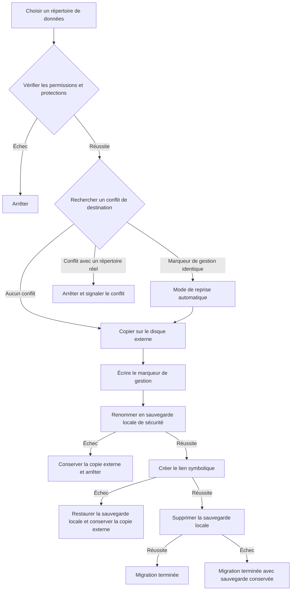

# Fonctionnement de la migration des données


La migration des données d’AppPorts déplace les répertoires associés aux applications vers un disque externe pour libérer de l’espace local. Deux stratégies sont utilisées selon leur emplacement :

| Répertoire | Stratégie | Raison |
|------|------|------|
| `~/Library/Containers/`, `~/Library/Group Containers/` | Migration par montage | Le bac à sable vérifie le chemin réel résolu et refuse les liens symboliques qui sortent du conteneur |
| Autres sous-répertoires de `~/Library/`, répertoires d’outils et dossiers personnalisés | Lien symbolique | La solution la plus simple, sans restriction du bac à sable |

Cette page décrit les liens symboliques. Pour l’autre stratégie, consultez [Migration par montage](mount-migration.md).

## Stratégie des liens symboliques <a href="#strategie-des-liens-symboliques" id="strategie-des-liens-symboliques"></a>

1. Copier intégralement le répertoire local sur le disque externe.
2. Écrire le marqueur de gestion `.appports-link-metadata.plist` dans le répertoire externe.
3. Renommer le répertoire local d’origine en sauvegarde de sécurité masquée sur le même volume.
4. Créer au chemin d’origine un lien symbolique vers la copie externe.
5. Supprimer la sauvegarde de sécurité une fois le lien créé.

```
~/Library/Application Support/SomeApp
    → /Volumes/External/AppPortsData/SomeApp  （符号链接）
```



## Marqueur de gestion <a href="#marqueur-de-gestion" id="marqueur-de-gestion"></a>

Le fichier `.appports-link-metadata.plist` dans le répertoire externe indique qu’AppPorts le gère :

| Champ | Description |
|------|------|
| `schemaVersion` | Numéro de version, actuellement 1 |
| `managedBy` | `com.shimoko.AppPorts` |
| `sourcePath` | Chemin local d’origine |
| `destinationPath` | Chemin de destination externe |
| `dataDirType` | Type de répertoire de données |

Lors de l’analyse, ce marqueur distingue les liens créés par AppPorts de ceux créés par l’utilisateur. Il permet aussi de reprendre une migration interrompue. La correspondance est stricte : les cinq champs doivent être identiques pour reprendre un répertoire géré. Sinon, il s’agit d’un conflit. Une taille similaire ne suffit jamais à reprendre la gestion ou à écraser les données.

La reconnexion et la normalisation concernent uniquement les répertoires. Un fichier ordinaire externe ne sera pas relié comme s’il s’agissait d’un répertoire.

## Types de répertoires de données pris en charge <a href="#types-de-repertoires-de-donnees-pris-en-charge" id="types-de-repertoires-de-donnees-pris-en-charge"></a>

| Type | Chemin | Stratégie |
|------|------|------|
| `applicationSupport` | `~/Library/Application Support/` | Lien symbolique |
| `preferences` | `~/Library/Preferences/` | Lien symbolique |
| `containers` | `~/Library/Containers/` | Montage |
| `groupContainers` | `~/Library/Group Containers/` | Montage |
| `caches` | `~/Library/Caches/` | Lien symbolique |
| `webKit` | `~/Library/WebKit/` | Lien symbolique |
| `httpStorages` | `~/Library/HTTPStorages/` | Lien symbolique |
| `applicationScripts` | `~/Library/Application Scripts/` | Lien symbolique |
| `logs` | `~/Library/Logs/` | Lien symbolique |
| `savedState` | `~/Library/Saved Application State/` | Lien symbolique |
| `dotFolder` | `~/.npm`, `~/.vscode`, etc. | Lien symbolique |
| `custom` | Chemin défini par l’utilisateur | Lien symbolique |

## Procédure de restauration <a href="#procedure-de-restauration" id="procedure-de-restauration"></a>

1. Vérifier que le chemin local est un lien symbolique vers un répertoire externe valide.
2. Copier le répertoire externe dans un répertoire temporaire local.
3. Supprimer le lien symbolique et renommer le répertoire temporaire avec le chemin d’origine.
4. Supprimer le répertoire externe, dans la mesure du possible.

Si la copie échoue, le lien symbolique reste intact. Si le renommage échoue, le lien est recréé et le répertoire temporaire est conservé pour une restauration manuelle.

## Gestion des erreurs et retour arrière <a href="#gestion-des-erreurs-et-retour-arriere" id="gestion-des-erreurs-et-retour-arriere"></a>

- **Échec de copie** : supprimer les fichiers externes déjà copiés et ne pas poursuivre.
- **Conflit de destination** : si un répertoire réel existe et que son marqueur ne correspond pas, arrêter et conserver les données des deux côtés.
- **Échec du renommage en sauvegarde** : arrêter et conserver la copie externe, sans toucher au répertoire source local.
- **Échec de création du lien symbolique** : remettre la sauvegarde au chemin d’origine tout en conservant la copie externe.
- **Échec du nettoyage de la sauvegarde** : la migration est terminée, mais la sauvegarde locale `.appports-migration-backup-*` reste présente. Vous pouvez la supprimer manuellement après vérification.
