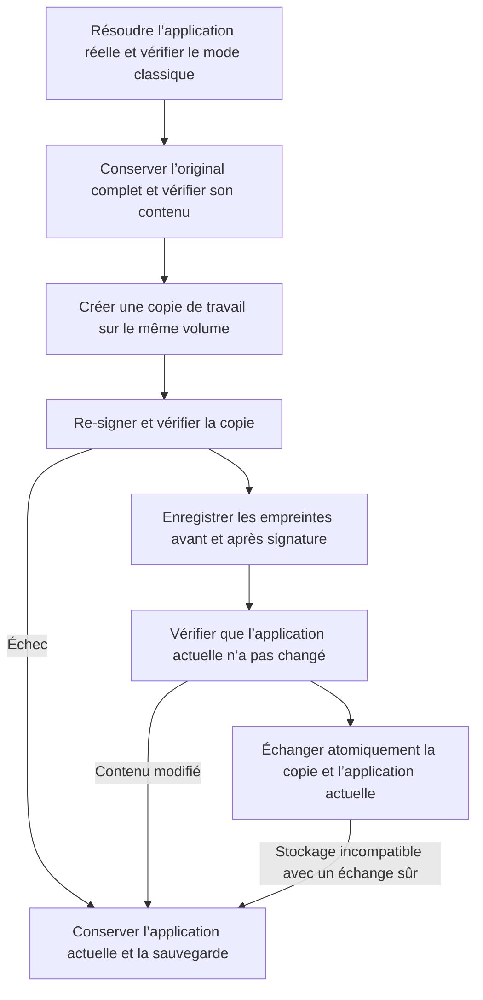

# Re-signature et prévention des plantages


**Re-signer n’est pas une réparation universelle**

Une re-signature Ad-hoc remplace la signature du développeur et retire les autorisations de bac à sable, de groupes d’applications et de trousseau. Une application en bac à sable, comme WeChat ou une application App Store, peut alors ne plus s’ouvrir sous macOS 27 et perdre sa session de connexion. La nouvelle version conserve d’abord l’application d’origine complète afin de restaurer sa signature et ses autorisations ; la restauration de la signature ne garantit pas celle d’une session déjà perdue.

Depuis la version 1.9.0, AppPorts refuse par défaut de re-signer les applications en bac à sable. Il faut activer le mode classique et confirmer les risques. Les données de conteneur utilisent désormais la [migration par montage](mount-migration.md), sans modification de signature. Voir [Données de conteneur, bac à sable et identité de signature](container-identity.md).


## Quel problème la re-signature résout-elle ? 

macOS vérifie l’intégrité des applications par leur signature de code. Après avoir déplacé l’application sur un disque externe et laissé un lanceur local, le système peut parfois la considérer comme modifiée et refuser son ouverture avec « endommagée » ou « développeur non identifié ». Une re-signature Ad-hoc de **l’application réelle sur le disque externe** peut alors lui permettre de passer la vérification.

C’est le seul rôle de la re-signature. Elle n’a pas de rapport avec la migration des répertoires de données ; son association à la migration des conteneurs dans les anciennes versions est à l’origine des problèmes sous macOS 27.

## Quand ne pas l’utiliser 

| Situation | Explication |
|------|------|
| Application en bac à sable | Refusée par défaut ; autorisée en mode classique après confirmation, mais privilégiez la migration par montage |
| Application App Store | Protégée par SIP, elle ne peut pas être re-signée |
| Application utilisant le trousseau pour sa session | La re-signature fait perdre la session |
| Application avec widgets ou extensions de partage | La perte des autorisations de groupes empêche les extensions de lire les données partagées |
| Application qui s’ouvre normalement | Ne re-signez pas en l’absence de problème |

N’envisagez cette option que si un message d’application endommagée apparaît réellement après migration externe, et essayez d’abord une réinstallation ou un nouveau téléchargement officiel.

## Commandes et réglages 

| Commande | Emplacement | Par défaut | Comportement |
|------|------|------|------|
| Resigner cette app | Menu contextuel de l’application | Manuelle | Sauvegarde complète, puis signature d’une copie de travail ; refuse les applications en bac à sable par défaut, exige une confirmation en mode classique |
| Re-signer après la migration | Barre d’outils des données, uniquement en mode classique | Désactivée | Re-signe l’application associée après migration par lien symbolique |
| Re-signature à la connexion | Réglages | Désactivée pour une nouvelle installation | Traite uniquement les anciens enregistrements ; ignore ceux disposant d’un instantané complet pour ne pas contourner la transaction de signature |
| Restaurer la signature originale | Menu contextuel, barre d’outils des données ou panneau de réparation | Manuelle | Restaure l’application d’origine depuis une sauvegarde complète ; un ancien enregistrement permet de choisir un original officiel de même version, sans clé privée du développeur |

La détection du bac à sable lit les autorisations de **l’application réelle**, pas du lanceur local. Si `com.apple.security.app-sandbox` vaut true, la signature est refusée. Le [mode classique](../settings.md#classic-data-migration-mode) l’autorise avec une seconde confirmation à chaque fois.

## Procédure de signature 

Le lanceur local est résolu vers l’application réelle : signature et restauration portent sur le vrai `.app` et n’écrasent pas le lanceur. Si la signature ou la vérification de la copie échoue, l’application actuelle reste intacte. Son état de verrouillage est également conservé.

## Sauvegarde et restauration de la signature 

**Une sauvegarde complète permet de restaurer la signature d’un développeur tiers sans sa clé privée.** La signature d’origine est déjà contenue dans les fichiers de l’application. La restauration remet ces fichiers en place ; elle ne signe pas de nouveau au nom du développeur. Le programme principal, les assistants imbriqués, les frameworks, les ressources de signature et les autorisations sont conservés avec l’application. Une application initialement Ad-hoc ou non signée retrouve aussi son état initial.

Les sauvegardes se trouvent dans `~/Library/Application Support/AppPorts/signature-backups/` : un enregistrement `.plist` associé à l’identifiant de l’application et une copie d’origine `original-…app`. Le format de version 2 conserve les empreintes du contenu original et du contenu re-signé. La copie sur écriture est privilégiée sur les systèmes de fichiers compatibles ; sinon, une copie complète est nécessaire. Prévoyez l’espace de la sauvegarde et de la copie de travail. Un espace insuffisant ou un échec de copie arrête la signature.

Pour restaurer :

1. Quittez l’application.
2. Si ses données de conteneur ont été migrées en mode classique, restaurez d’abord les répertoires dans « App Data ». Une fois son identité de bac à sable rétablie, l’application ne peut plus suivre de liens symboliques hors de son conteneur. AppPorts vérifie ce point et empêche de sauter cette étape.
3. Cliquez sur « Restaurer la signature originale » dans le menu contextuel, la barre d’outils des données ou le panneau de réparation.
4. AppPorts vérifie la sauvegarde, contrôle si l’application a été mise à jour ou modifiée, valide la signature d’origine dans une copie de travail, puis remplace l’application de façon sûre. La sauvegarde est supprimée après réussite.

**Si l’application a changé ou si la sauvegarde est endommagée, la restauration s’arrête en conservant les deux.** Une ancienne version ne remplace jamais une version récente et une signature récente n’est pas mélangée avec une ancienne sauvegarde. Si le stockage ne permet pas l’échange atomique, ramenez d’abord l’application localement avant l’opération de signature. L’analyse ordinaire ne supprime pas les éléments de restauration.

Après une mise à jour ou réinstallation officielle, si la signature est strictement valide et que l’identité du développeur correspond à l’enregistrement, la prochaine re-signature crée une nouvelle sauvegarde complète de l’application actuelle. L’ancien enregistrement est archivé dans `signature-backups/retired/` et son ancienne copie d’origine est conservée, sans intervenir dans la nouvelle restauration. Elle occupe toujours de l’espace. Si vous n’avez plus besoin de cette version, retrouvez sa copie via `snapshotName` dans l’enregistrement archivé avant de la supprimer.

### Que faire d’une ancienne sauvegarde contenant seulement le nom de l’identité ? 

Les anciens `.plist` contiennent l’identifiant de l’application, le nom de l’identité de signature, le chemin et la date, mais aucun programme original ni autorisation. Ils ne permettent donc pas de restaurer la signature. Traiter un enregistrement Ad-hoc comme une suppression de signature, ou re-signer à partir d’un nom d’identité, ne constitue pas une véritable restauration.

La nouvelle version conserve ces enregistrements et propose « Choisir l’app d’origine… ». Obtenez un `.app` original officiel de **la même application et de la même version**. AppPorts vérifie le Bundle ID, la version et la signature, ainsi que l’identité du développeur si elle figure dans l’enregistrement. Après validation, il restaure l’original à l’emplacement de l’application réelle actuelle ; le lanceur local reste valide. L’original sélectionné n’est pas modifié.

Si vous ne trouvez pas la même version, suivez les [étapes de réparation](../macos-27.md#reparation) : restaurez les données, ramenez l’application localement et réinstallez depuis une source officielle. Un ancien enregistrement seul ne permet pas de recréer la signature perdue.

## Risques liés aux types d’applications 

Ces risques ne concernent pas directement la re-signature, mais sont souvent abordés ensemble :

| Type d’application | Risque | Explication |
|------|------|------|
| Applications à mise à jour automatique Sparkle / Electron | Élevé | L’outil de mise à jour peut supprimer ou remplacer l’application externe ; utilisez « Migration verrouillée » |
| Chrome / Edge | Moyen | Les mises à jour se réinstallent localement ; « Sortie en attente » invite à migrer de nouveau |
| Applications App Store | Élevé | Impossible de les re-signer ; sous macOS 15.1+, privilégiez l’installation externe native de l’App Store |

Voir [Détection des mises à jour automatiques](../migration-strategy/updater-detection.md) et [Types d’applications et stratégies](../migration-strategy/strategy-map.md).
