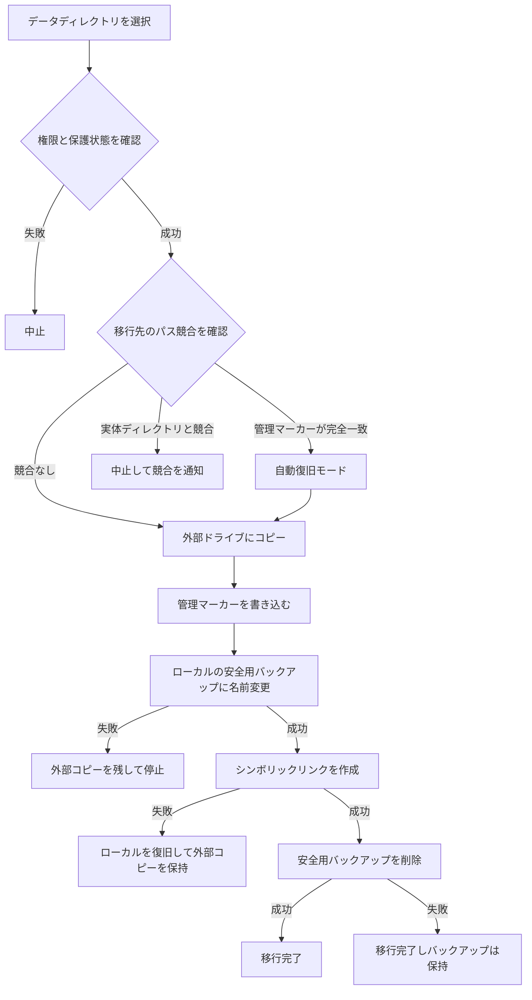

# データ移行の基本実装


AppPorts のデータ移行は、アプリに関連するデータディレクトリを外部ドライブに移し、ローカルの空き容量を増やします。ディレクトリの場所に応じて 2 つの方式を使います。

| ディレクトリ | 方式 | 理由 |
|------|------|------|
| `~/Library/Containers/`、`~/Library/Group Containers/` | マウント移行 | サンドボックスは解決後の実際のパスを検査するため、コンテナ外へのシンボリックリンクは拒否されます |
| その他の `~/Library/` サブディレクトリ、ツールディレクトリ、カスタムフォルダ | シンボリックリンク | サンドボックスの制限を受けず、最も単純な方式です |

このページではシンボリックリンク方式を説明します。マウント方式は[マウント移行](mount-migration.md)を参照してください。

## シンボリックリンク方式 <a href="#シンボリックリンク方式" id="シンボリックリンク方式"></a>

1. ローカルのディレクトリを外部ドライブにすべてコピーします。
2. 外部のディレクトリに管理マーカー `.appports-link-metadata.plist` を書き込みます。
3. ローカルの元ディレクトリを、同じボリューム上の非表示の安全用バックアップに名前変更します。
4. 元のパスに、外部コピーを指すシンボリックリンクを作成します。
5. リンクの作成に成功したら、安全用バックアップを削除します。

```
~/Library/Application Support/SomeApp
    → /Volumes/External/AppPortsData/SomeApp  （符号链接）
```



## 管理マーカー <a href="#管理マーカー" id="管理マーカー"></a>

外部ディレクトリの `.appports-link-metadata.plist` は、AppPorts がそのディレクトリを管理していることを示します。

| フィールド | 説明 |
|------|------|
| `schemaVersion` | バージョン番号。現在は 1 |
| `managedBy` | `com.shimoko.AppPorts` |
| `sourcePath` | 元のローカルパス |
| `destinationPath` | 外部の移行先パス |
| `dataDirType` | データディレクトリの種類 |

スキャン時には AppPorts が作ったリンクと手動作成のリンクを区別し、移行中断時には自動復旧に使います。照合は厳密で、5 つのフィールドがすべて一致する場合だけ処理を再開できる管理対象とみなします。それ以外は競合として扱い、サイズが似ているだけで管理を引き継いだり上書きしたりすることはありません。

再リンクと整理の対象はディレクトリだけです。外部の通常ファイルをディレクトリとして再リンクしません。

## 対応するデータディレクトリ <a href="#対応するデータディレクトリ" id="対応するデータディレクトリ"></a>

| 種類 | パス | 方式 |
|------|------|------|
| `applicationSupport` | `~/Library/Application Support/` | シンボリックリンク |
| `preferences` | `~/Library/Preferences/` | シンボリックリンク |
| `containers` | `~/Library/Containers/` | マウント |
| `groupContainers` | `~/Library/Group Containers/` | マウント |
| `caches` | `~/Library/Caches/` | シンボリックリンク |
| `webKit` | `~/Library/WebKit/` | シンボリックリンク |
| `httpStorages` | `~/Library/HTTPStorages/` | シンボリックリンク |
| `applicationScripts` | `~/Library/Application Scripts/` | シンボリックリンク |
| `logs` | `~/Library/Logs/` | シンボリックリンク |
| `savedState` | `~/Library/Saved Application State/` | シンボリックリンク |
| `dotFolder` | `~/.npm`、`~/.vscode` など | シンボリックリンク |
| `custom` | ユーザーが指定したパス | シンボリックリンク |

## 復元の流れ <a href="#復元の流れ" id="復元の流れ"></a>

1. ローカルのパスが、有効な外部ディレクトリを指すシンボリックリンクであることを確認します。
2. 外部ディレクトリをローカルの一時ディレクトリにコピーします。
3. シンボリックリンクを削除し、一時ディレクトリを元のパスに名前変更します。
4. 外部ディレクトリを可能な範囲で削除します。

コピーに失敗した場合、シンボリックリンクは変更しません。名前変更に失敗した場合はリンクを再作成し、手動で復旧できるよう一時ディレクトリを残します。

## エラー処理とロールバック <a href="#エラー処理とロールバック" id="エラー処理とロールバック"></a>

- **コピー失敗**：コピーした外部ファイルを削除し、後続の処理は行いません。
- **移行先の競合**：外部に実体ディレクトリがあり、マーカーが一致しない場合は停止し、両方のデータを保持します。
- **安全用バックアップへの名前変更失敗**：停止して外部コピーを残し、ローカルの元ディレクトリは変更しません。
- **シンボリックリンク作成失敗**：バックアップを元のパスに戻し、外部コピーも保持します。
- **安全用バックアップの削除失敗**：移行は完了として扱い、ローカルに `.appports-migration-backup-*` を残します。問題がないと確認してから手動で削除できます。
