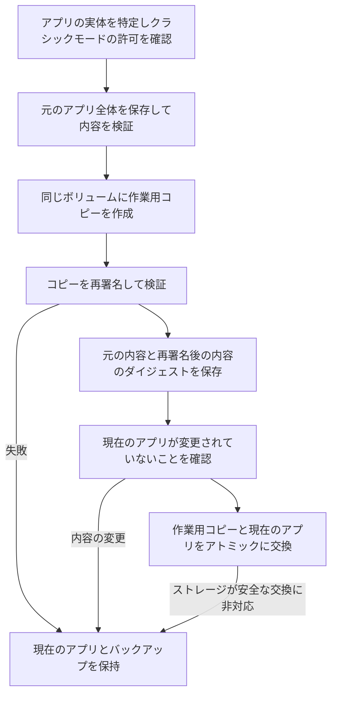

# 再署名とクラッシュ対策


**再署名ですべての問題を解決できるわけではありません**

Ad-hoc 再署名はアプリの開発元の署名を置き換え、サンドボックス、アプリグループ、キーチェーンのエンタイトルメントを削除します。サンドボックスアプリ（WeChat、App Store アプリなど）は、macOS 27 で開けなくなったり、ログイン状態が失われたりする可能性があります。新しいバージョンでは元のアプリ全体を先に保存するため、後から署名と元のエンタイトルメントを復元できます。ただし、失われたログイン状態まで戻るとは限りません。

1.9.0 以降、AppPorts はサンドボックスアプリの再署名をデフォルトで拒否します。クラシックモードを有効にしてリスクを確認した場合のみ許可します。コンテナデータには、署名を変更しない[マウント移行](mount-migration.md)を使用します。経緯は[コンテナデータ、サンドボックスと署名 ID](container-identity.md)を参照してください。


## 再署名で解決できる問題 

macOS はコード署名でアプリバンドルの整合性を検証します。アプリ本体を外部ドライブに移し、ローカルに起動用シェルだけを残すと、状況によってはアプリが変更されたと判定され、「壊れている」または「開発元が未確認」という警告で起動できなくなります。その場合、**外部ドライブにあるアプリの実体**を Ad-hoc で再署名すると、検証を通過できることがあります。

再署名の用途はこれだけです。データディレクトリの移行とは関係ありません。旧バージョンが再署名をコンテナデータの移行と組み合わせたことが、macOS 27 での問題の原因になりました。

## 使用すべきでない場合 

| 状況 | 説明 |
|------|------|
| サンドボックスアプリ | デフォルトで拒否します。クラシックモードでリスクを確認すれば許可されますが、マウント移行を優先してください |
| App Store アプリ | SIP によって保護されているため、署名できません |
| ログイン状態をキーチェーンに保存するアプリ | 再署名するとログイン状態が失われます |
| ウィジェットや共有機能拡張を持つアプリ | アプリグループのエンタイトルメントが失われ、機能拡張が共有データを読めなくなります |
| 正常に開けるアプリ | 問題がなければ再署名は不要です |

検討するのは「外部ドライブへの移行後に、実際に破損の警告が出た」場合だけです。その場合も、まず再インストールや公式サイトからの再ダウンロードを試してください。

## 操作場所と設定 

| 操作 | 場所 | デフォルト | 動作 |
|------|------|------|------|
| Resign This App | アプリ一覧の右クリックメニュー | 手動 | アプリ全体をバックアップし、作業用コピーで署名します。サンドボックスアプリはデフォルトで拒否し、クラシックモードではリスクの確認が必要です |
| Re-sign after migration | データディレクトリページ上部のツールバー。クラシックモードでのみ表示 | オフ | シンボリックリンク移行の完了後、関連するアプリを再署名します |
| ログイン時自動再署名 | 設定ページ | 新規インストールではオフ | 旧形式の記録のみ処理します。署名のトランザクションを迂回しないよう、完全なスナップショットを持つ新形式の記録はスキップします |
| Restore Original Signature | アプリ一覧の右クリックメニュー、データページのツールバー、修復パネル | 手動 | 完全なバックアップから元のアプリを復元します。旧形式の記録では同じバージョンの公式アプリを選択できます。開発元の秘密鍵は不要です |

サンドボックスの判定には、ローカルの起動用シェルではなく、**アプリの実体**のエンタイトルメントを使用します。`com.apple.security.app-sandbox` が true なら拒否します。[クラシックデータ移行モード](../settings.md#classic-data-migration-mode)を有効にするとサンドボックスアプリも再署名できますが、毎回追加の確認が表示されます。

## 署名の流れ 

ローカルの起動用シェルから先にアプリの実体を特定します。署名と復元は実際の `.app` に対して行うため、起動用シェルは上書きしません。作業用コピーの署名や検証が失敗した場合、現在のアプリは変更されません。元のロック状態も維持します。

## 署名のバックアップと復元 

**完全なバックアップがあれば、開発元の秘密鍵なしでサードパーティの開発元の署名を復元できます。** 元の署名はアプリのファイルに含まれています。復元では、その元のファイルを戻します。開発元として再度署名するわけではありません。メイン実行ファイル、内包されたヘルパー、フレームワーク、署名リソース、元のエンタイトルメントをアプリ全体とともに保存します。元から Ad-hoc 署名だったアプリや未署名のアプリも、それぞれ元の状態に戻します。

バックアップは `~/Library/Application Support/AppPorts/signature-backups/` に保存します。アプリの識別子に対応する `.plist` 記録と、`original-…app` という元のアプリのコピーで構成されます。記録はバージョン 2 形式で、元の内容と再署名後の内容のダイジェストを保持します。対応するファイルシステムではコピーオンライトを優先します。それ以外は完全なコピーが必要なため、バックアップと作業用コピーの空き容量を確保してください。容量不足やコピーの失敗時は署名を中止します。

復元の手順：

1. アプリを終了します。
2. クラシックモードでコンテナデータを移行した場合は、先に「アプリデータ」で該当するディレクトリを復元します。サンドボックスの ID が戻ると、アプリはシンボリックリンク経由でコンテナ外のデータを読めなくなります。AppPorts はこの状態を確認し、この手順を省略できないようにします。
3. アプリの右クリックメニュー、データページのツールバー、または修復パネルで「Restore Original Signature」をクリックします。
4. AppPorts がバックアップを検証し、現在のアプリが更新または変更されていないか確認します。作業用コピーで元の署名を検証してから、現在のアプリを安全に置き換えます。成功したらバックアップを削除します。

**アプリの更新、内容の変更、バックアップの破損を検出すると復元を停止し、現在のアプリとバックアップを保持します。** 新しいアプリを古いバージョンで上書きしたり、新版の再署名結果と旧版のバックアップを混在させたりしません。アトミックな交換に対応しないストレージでは、アプリをローカルに戻してから署名操作を行ってください。通常のスキャンで復元用のデータが自動的に削除されることはありません。

公式の更新や再インストール後、現在のアプリが厳密な署名検証に合格し、開発元の ID が記録と一致していれば、次の再署名時に現在のアプリの完全なバックアップを作成します。古い記録は `signature-backups/retired/` に移し、対応する古い元アプリのコピーも保持して、新版の復元処理とは区別します。保存された古いコピーは引き続き容量を使用します。旧版が不要になったら、保管された記録の `snapshotName` から該当するコピーを特定して削除できます。

### 旧版のバックアップに署名 ID の名前しかない場合 

旧版の `.plist` にはアプリの識別子、署名 ID の名前、パス、日時しかなく、元のプログラムやエンタイトルメントはありません。その記録だけでは署名を復元できません。旧版で Ad-hoc の記録を「署名の削除」として扱ったり、ID の名前を使って再署名したりしていた動作は、実際の復元ではありません。

新版はこれらの記録を保持し、「オリジナル版アプリを選択…」を提供します。公式の配布元から**同じアプリの同じバージョン**の元の `.app` を入手してください。AppPorts は Bundle ID、バージョン、署名を検証し、元の記録に開発元の ID があれば、それも照合します。検証に合格すると、現在のアプリの実体の場所に元のアプリを復元します。ローカルの起動用エントリはそのまま使えます。選択した元のアプリ自体は変更しません。

同じバージョンの元のアプリが見つからない場合は、[修復手順](../macos-27.md#修復)に従ってデータを復元し、アプリをローカルに戻してから公式の配布元から再インストールしてください。古い記録だけで失われた署名を作り直すことはできません。

## 関連するアプリ種別ごとのリスク 

再署名とは直接関係しませんが、よく併せて質問される内容です。

| アプリ種別 | リスク | 説明 |
|----------|------|------|
| Sparkle / Electron の自動更新アプリ | 高 | 更新プログラムが外部ドライブのアプリを削除または置換する可能性があります。「Locked Migration」を使用してください |
| Chrome / Edge | 中 | 更新がローカルにインストールされます。AppPorts は「移行待ち」と表示し、再度の移行を案内します |
| App Store アプリ | 高 | 署名できません。macOS 15.1+ では App Store の外部ドライブへのインストールを推奨します |

[自動更新アプリの検出](../migration-strategy/updater-detection.md)と[アプリ種別と移行方法の対応表](../migration-strategy/strategy-map.md)も参照してください。
