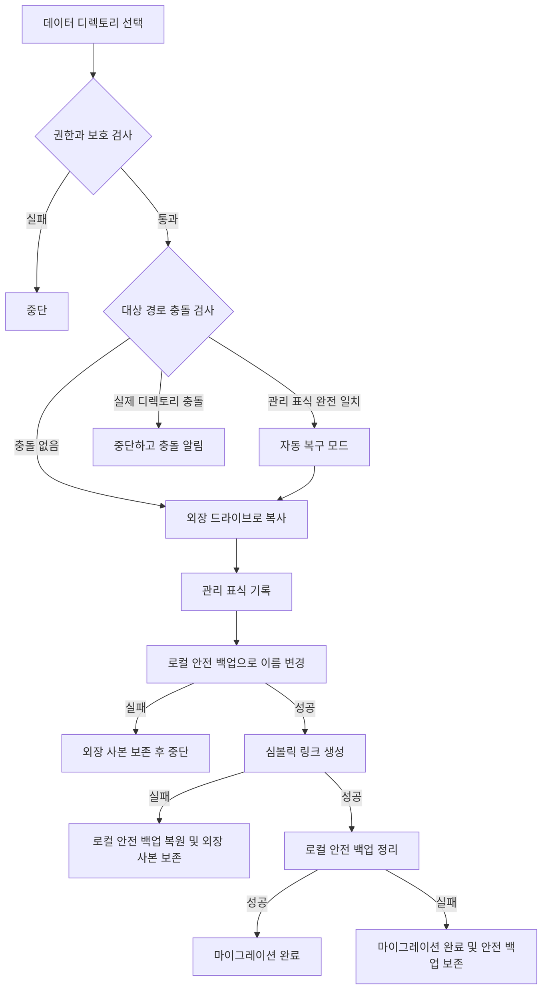

# 데이터 마이그레이션 기본 구현


AppPorts는 앱과 연결된 데이터 디렉토리를 외장 드라이브로 옮겨 로컬 공간을 확보합니다. 디렉토리 위치에 따라 두 방식을 사용합니다.

| 디렉토리 | 방식 | 이유 |
|------|------|------|
| `~/Library/Containers/`, `~/Library/Group Containers/` | 마운트 마이그레이션 | 샌드박스가 해석된 실제 경로를 확인하므로 컨테이너 밖을 가리키는 심볼릭 링크를 거부 |
| 그 밖의 `~/Library/` 하위 디렉토리, 도구 디렉토리, 사용자 지정 폴더 | 심볼릭 링크 | 샌드박스 제한이 없으며 가장 간단한 방식 |

이 페이지는 심볼릭 링크 방식을 설명합니다. 다른 방식은 [마운트 마이그레이션](mount-migration.md)을 참고하세요.

## 심볼릭 링크 방식 <a href="#심볼릭-링크-방식" id="심볼릭-링크-방식"></a>

1. 로컬 디렉토리를 외장 드라이브에 완전히 복사합니다.
2. 외장 디렉토리에 관리 표식 `.appports-link-metadata.plist`를 기록합니다.
3. 원래 로컬 디렉토리의 이름을 바꾸어 같은 볼륨의 숨김 안전 백업으로 만듭니다.
4. 원래 경로에 외장 사본을 가리키는 심볼릭 링크를 만듭니다.
5. 링크 생성에 성공하면 안전 백업을 정리합니다.

```
~/Library/Application Support/SomeApp
    → /Volumes/External/AppPortsData/SomeApp  （符号链接）
```



## 관리 표식 <a href="#관리-표식" id="관리-표식"></a>

외장 디렉토리의 `.appports-link-metadata.plist`는 AppPorts가 관리하는 디렉토리임을 나타냅니다.

| 필드 | 설명 |
|------|------|
| `schemaVersion` | 버전 번호. 현재 1 |
| `managedBy` | `com.shimoko.AppPorts` |
| `sourcePath` | 원래 로컬 경로 |
| `destinationPath` | 외장 대상 경로 |
| `dataDirType` | 데이터 디렉토리 유형 |

스캔할 때 AppPorts가 만든 링크와 사용자가 직접 만든 링크를 구분하며, 중단된 마이그레이션을 자동으로 복구할 때도 사용합니다. 다섯 필드가 모두 일치해야 이어서 처리할 수 있는 관리 디렉토리로 인정합니다. 그 외에는 충돌로 간주하며, 크기가 비슷하다는 이유만으로 관리하거나 덮어쓰지 않습니다.

다시 연결과 정리는 디렉토리에만 적용됩니다. 일반 외장 파일을 디렉토리로 취급해 다시 연결하지 않습니다.

## 지원하는 데이터 디렉토리 유형 <a href="#지원하는-데이터-디렉토리-유형" id="지원하는-데이터-디렉토리-유형"></a>

| 유형 | 경로 | 방식 |
|------|------|------|
| `applicationSupport` | `~/Library/Application Support/` | 심볼릭 링크 |
| `preferences` | `~/Library/Preferences/` | 심볼릭 링크 |
| `containers` | `~/Library/Containers/` | 마운트 |
| `groupContainers` | `~/Library/Group Containers/` | 마운트 |
| `caches` | `~/Library/Caches/` | 심볼릭 링크 |
| `webKit` | `~/Library/WebKit/` | 심볼릭 링크 |
| `httpStorages` | `~/Library/HTTPStorages/` | 심볼릭 링크 |
| `applicationScripts` | `~/Library/Application Scripts/` | 심볼릭 링크 |
| `logs` | `~/Library/Logs/` | 심볼릭 링크 |
| `savedState` | `~/Library/Saved Application State/` | 심볼릭 링크 |
| `dotFolder` | `~/.npm`, `~/.vscode` 등 | 심볼릭 링크 |
| `custom` | 사용자 지정 경로 | 심볼릭 링크 |

## 복원 과정 <a href="#복원-과정" id="복원-과정"></a>

1. 로컬 경로가 유효한 외장 디렉토리를 가리키는 심볼릭 링크인지 확인합니다.
2. 외장 디렉토리를 로컬 임시 디렉토리에 복사합니다.
3. 심볼릭 링크를 삭제하고 임시 디렉토리를 원래 경로로 바꿉니다.
4. 가능한 경우 외장 디렉토리를 삭제합니다.

복사에 실패하면 링크를 건드리지 않습니다. 이름 변경에 실패하면 링크를 재생성하고 수동 복구를 위해 임시 디렉토리를 보존합니다.

## 오류 처리와 롤백 <a href="#오류-처리와-롤백" id="오류-처리와-롤백"></a>

- **복사 실패:** 이미 복사한 외장 파일을 정리하고 후속 작업을 하지 않습니다.
- **대상 충돌:** 외장에 실제 디렉토리가 있고 표식이 일치하지 않으면 중단하고 양쪽 데이터를 보존합니다.
- **안전 백업 이름 변경 실패:** 중단하고 외장 사본을 보존하며 로컬 원본은 변경하지 않습니다.
- **심볼릭 링크 생성 실패:** 안전 백업을 원래 경로로 되돌리고 외장 사본도 보존합니다.
- **안전 백업 정리 실패:** 마이그레이션은 완료로 처리합니다. 로컬에 `.appports-migration-backup-*`가 남으며 확인 후 수동으로 삭제할 수 있습니다.
