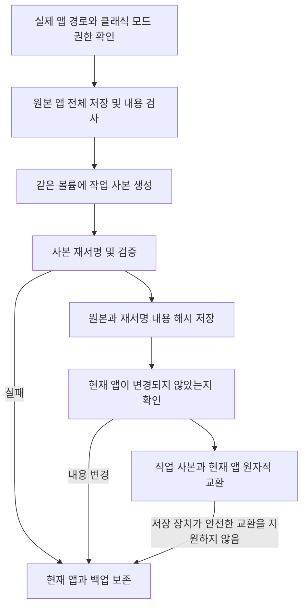

# 재서명과 충돌 방지


**재서명은 범용 복구 수단이 아닙니다**

Ad-hoc 재서명은 개발자 서명을 교체하고 샌드박스, 앱 그룹, 키체인 권한을 제거합니다. WeChat이나 App Store 앱 같은 샌드박스 앱은 macOS 27에서 열리지 않거나 로그인 상태를 잃을 수 있습니다. 새 버전은 원본 앱 전체를 먼저 보관하므로 나중에 서명과 기존 권한을 복원할 수 있습니다. 이미 잃은 로그인 상태까지 복구된다고 보장하지는 않습니다.

1.9.0부터 샌드박스 앱 재서명은 기본적으로 거부하며 클래식 모드를 켜고 위험을 확인한 경우에만 허용합니다. 컨테이너 데이터는 서명 변경 없이 [마운트 마이그레이션](mount-migration.md)으로 옮깁니다. 배경은 [컨테이너 데이터, 샌드박스와 서명 신원](container-identity.md)을 참고하세요.


## 재서명이 해결하는 문제 

macOS는 코드 서명으로 앱 번들의 무결성을 검사합니다. 실제 앱을 외장 드라이브로 옮기고 로컬에 실행 껍데기만 두면 일부 상황에서 시스템이 앱을 수정된 것으로 판단해 손상되었거나 확인되지 않은 개발자의 앱이라는 안내와 함께 실행을 거부할 수 있습니다. 이때 **외장 드라이브의 실제 앱**을 Ad-hoc 재서명하면 검사를 통과할 수 있습니다.

이것이 재서명의 유일한 용도입니다. 데이터 디렉토리 마이그레이션과는 관계없습니다. 이전 버전이 이를 컨테이너 데이터 마이그레이션과 묶은 것이 macOS 27 문제의 원인이었습니다.

## 사용하지 말아야 할 경우 

| 상황 | 설명 |
|------|------|
| 샌드박스 앱 | 기본적으로 거부. 클래식 모드에서 위험 확인 후 가능하지만 마운트 마이그레이션 우선 |
| App Store 앱 | SIP 보호로 서명 불가 |
| 키체인 로그인 상태에 의존하는 앱 | 재서명 후 로그인 상태 손실 |
| 위젯이나 공유 확장이 있는 앱 | 앱 그룹 권한이 사라져 확장이 공유 데이터를 읽지 못함 |
| 정상적으로 열리는 앱 | 문제가 없다면 서명하지 않기 |

외장 드라이브로 옮긴 뒤 실제로 손상 메시지가 뜨는 경우에만 고려하세요. 그전에도 재설치나 공식 사이트에서 다시 다운로드하는 방법을 먼저 시도하세요.

## 진입점과 설정 

| 항목 | 위치 | 기본값 | 동작 |
|------|------|------|------|
| 이 앱 재서명 | 앱 목록 우클릭 메뉴 | 수동 | 전체 백업 후 작업 사본에 서명. 기본적으로 샌드박스 앱 거부, 클래식 모드는 위험 확인 필요 |
| 마이그레이션 후 재서명 | 데이터 디렉토리 상단 도구 막대, 클래식 모드에만 표시 | 꺼짐 | 심볼릭 링크 마이그레이션 후 연결된 앱 재서명 |
| 로그인 시 자동 재서명 | 설정 | 새 설치 시 꺼짐 | 이전 기록만 처리. 전체 스냅샷이 있는 새 기록은 건너뛰어 서명 트랜잭션 우회 방지 |
| 원본 서명 복원 | 앱 우클릭 메뉴, 데이터 페이지 도구 막대, 복구 패널 | 수동 | 전체 백업에서 원래 앱 복원. 이전 기록은 같은 버전의 공식 원본 선택 가능. 개발자 개인 키 불필요 |

샌드박스 판정은 로컬 실행 껍데기가 아닌 **실제 앱**의 권한을 읽습니다. `com.apple.security.app-sandbox`가 true면 거부합니다. [클래식 데이터 마이그레이션 모드](../settings.md#classic-data-migration-mode)에서는 매번 추가 확인을 거쳐 허용합니다.

## 서명 과정 

로컬 실행 껍데기는 먼저 실제 앱 경로로 해석합니다. 서명과 복원은 실제 `.app`에 적용하며 껍데기를 덮어쓰지 않습니다. 작업 사본의 서명이나 검증이 실패하면 현재 앱은 바뀌지 않으며 기존 잠금 상태도 보존합니다.

## 서명 백업과 복원 

**전체 백업은 타사 개발자의 개인 키 없이 개발자 서명을 복원할 수 있습니다.** 원본 서명이 이미 앱 파일에 포함되어 있기 때문입니다. 개발자 신원으로 다시 서명하는 것이 아니라 원래 파일을 복원합니다. 주 프로그램, 중첩된 도우미, 프레임워크, 서명 리소스와 기존 권한을 모두 저장합니다. 원래 Ad-hoc 서명이었거나 서명되지 않은 앱도 각각 원래 상태로 복원합니다.

백업은 `~/Library/Application Support/AppPorts/signature-backups/`에 있으며 앱 식별자에 대응하는 `.plist` 기록과 `original-…app` 원본 사본으로 구성됩니다. 버전 2 형식의 기록에 원본과 재서명된 내용의 해시를 저장합니다. 지원 파일 시스템에서는 쓰기 시 복사를 우선 사용하며 그 외에는 전체 복사가 필요합니다. 백업과 작업 사본을 위한 공간을 확보하세요. 공간이 부족하거나 복사에 실패하면 서명을 중단합니다.

복원 단계:

1. 앱을 종료합니다.
2. 클래식 모드로 컨테이너 데이터를 옮겼다면 먼저 ‘앱 데이터’에서 해당 디렉토리를 복원합니다. 샌드박스 신원이 돌아오면 심볼릭 링크로 컨테이너 밖 데이터를 읽을 수 없습니다. AppPorts는 이를 검사하며 생략하지 못하게 합니다.
3. 앱 우클릭 메뉴, 데이터 페이지 도구 막대 또는 복구 패널에서 ‘원본 서명 복원’을 누릅니다.
4. AppPorts가 백업과 현재 앱의 업데이트·변경 여부를 검사합니다. 작업 사본에서 원본 서명을 검증한 뒤 안전하게 현재 앱을 교체하고 성공 후 백업을 정리합니다.

**앱 업데이트, 내용 변경, 백업 손상이 있으면 복원을 중단하고 현재 앱과 백업을 보존합니다.** 이전 버전으로 새 버전을 덮어쓰거나 새 버전의 재서명 결과와 이전 백업을 혼용하지 않습니다. 원자적 교환을 지원하지 않는 저장 장치에서는 앱을 먼저 이 Mac으로 옮긴 뒤 서명해야 합니다. 일반 스캔은 복구 자료를 자동 삭제하지 않습니다.

공식 업데이트나 재설치 후 현재 앱이 엄격한 서명 검사를 통과하고 개발자 신원이 기록과 같으면, 다시 재서명할 때 현재 앱의 전체 백업을 새로 만듭니다. 이전 기록은 `signature-backups/retired/`에 보관하고 해당 원본 사본도 남겨 새 버전 복원에 섞이지 않게 합니다. 보관 사본은 여전히 공간을 차지합니다. 이전 버전이 필요 없는지 확인한 뒤 기록의 `snapshotName`으로 해당 사본을 찾아 정리할 수 있습니다.

### 신원 이름만 있는 이전 백업은 어떻게 하나요? 

이전 `.plist`에는 앱 식별자, 서명 신원 이름, 경로와 시간만 있습니다. 원본 프로그램과 권한 데이터가 없어 서명을 복원할 수 없습니다. 이전 버전이 Ad-hoc 기록을 서명 제거로 처리하거나 신원 이름으로 다시 서명하던 동작은 실제 복원이 아니었습니다.

새 버전은 이 기록을 보존하고 ‘원본 앱 선택…’을 제공합니다. 공식 경로에서 **같은 앱, 같은 버전**의 원본 `.app`을 구하세요. AppPorts는 Bundle ID, 버전과 서명을 검사하며 이전 기록에 개발자 신원이 있으면 그것도 확인합니다. 통과하면 현재 실제 앱 위치에 원본을 복원합니다. 로컬 실행 진입점은 계속 유효하며 선택한 원본 앱은 변경하지 않습니다.

같은 버전의 원본을 구할 수 없다면 [복구 단계](../macos-27.md#복구)에 따라 데이터 복원, 실제 앱의 로컬 이동 후 공식 경로에서 재설치하세요. 이전 기록만으로 이미 잃은 서명을 만들어낼 수는 없습니다.

## 앱 유형별 관련 위험 

재서명과 직접 관련은 없지만 함께 자주 질문하는 내용입니다.

| 앱 유형 | 위험 | 설명 |
|----------|------|------|
| Sparkle / Electron 자동 업데이트 앱 | 높음 | 업데이터가 외장 앱을 삭제하거나 교체할 수 있으므로 ‘잠금 마이그레이션’ 사용 |
| Chrome / Edge | 중간 | 업데이트가 로컬에 설치되면 ‘내보내기 대기’로 다시 마이그레이션하도록 안내 |
| App Store 앱 | 높음 | 서명 불가. macOS 15.1+에서는 App Store 자체 외장 설치 권장 |

[자동 업데이트 앱 인식](../migration-strategy/updater-detection.md)과 [앱 유형 및 전략 비교](../migration-strategy/strategy-map.md)를 참고하세요.
