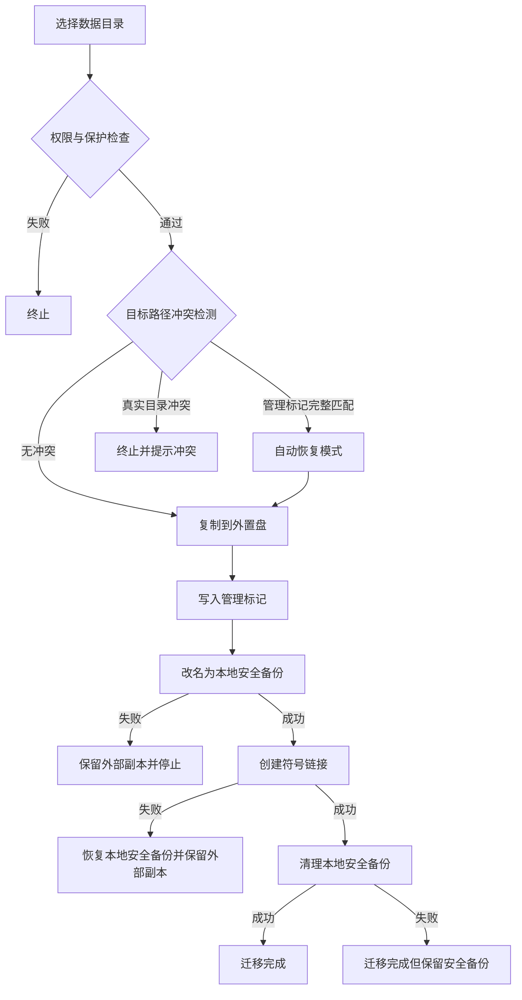

# 数据迁移基础实现


AppPorts 的数据迁移把应用关联的数据目录搬到外置盘，释放本地空间。按目录所在位置用两种策略：

| 目录 | 策略 | 原因 |
|------|------|------|
| `~/Library/Containers/`、`~/Library/Group Containers/` | 挂载迁移 | 沙盒检查解析后的真实路径，符号链接指向容器外会被拒绝 |
| 其它 `~/Library/` 子目录、工具目录、自定义文件夹 | 符号链接 | 不受沙盒限制，最简单 |

本页讲符号链接策略。挂载迁移见[挂载迁移](mount-migration.md)。

## 符号链接策略 <a href="#符号链接策略" id="符号链接策略"></a>

1. 把本地目录完整复制到外置盘。
2. 在外部目录写入管理标记 `.appports-link-metadata.plist`。
3. 把本地原目录改名为同卷隐藏安全备份。
4. 在原路径创建指向外部副本的符号链接。
5. 链接创建成功后清理安全备份。

```
~/Library/Application Support/SomeApp
    → /Volumes/External/AppPortsData/SomeApp  （符号链接）
```



## 管理标记 <a href="#管理标记" id="管理标记"></a>

外部目录里的 `.appports-link-metadata.plist` 标识该目录由 AppPorts 管理：

| 字段 | 说明 |
|------|------|
| `schemaVersion` | 版本号，当前为 1 |
| `managedBy` | `com.shimoko.AppPorts` |
| `sourcePath` | 原始本地路径 |
| `destinationPath` | 外部目标路径 |
| `dataDirType` | 数据目录类型 |

扫描时用它区分 AppPorts 建的链接和用户自己建的链接；迁移中断时用它自动恢复。匹配是严格的：五个字段全部一致才算可接续的管理目录，否则视为冲突，不会因为目录大小相近就接管或覆盖。

接回和整理只对目录有效，不会把外部普通文件当作目录重新链接。

## 支持的数据目录类型 <a href="#支持的数据目录类型" id="支持的数据目录类型"></a>

| 类型 | 路径 | 策略 |
|------|------|------|
| `applicationSupport` | `~/Library/Application Support/` | 符号链接 |
| `preferences` | `~/Library/Preferences/` | 符号链接 |
| `containers` | `~/Library/Containers/` | 挂载 |
| `groupContainers` | `~/Library/Group Containers/` | 挂载 |
| `caches` | `~/Library/Caches/` | 符号链接 |
| `webKit` | `~/Library/WebKit/` | 符号链接 |
| `httpStorages` | `~/Library/HTTPStorages/` | 符号链接 |
| `applicationScripts` | `~/Library/Application Scripts/` | 符号链接 |
| `logs` | `~/Library/Logs/` | 符号链接 |
| `savedState` | `~/Library/Saved Application State/` | 符号链接 |
| `dotFolder` | `~/.npm`、`~/.vscode` 等 | 符号链接 |
| `custom` | 用户自定义路径 | 符号链接 |

## 还原流程 <a href="#还原流程" id="还原流程"></a>

1. 确认本地路径是符号链接，且指向有效的外部目录。
2. 把外部目录复制到本地暂存目录。
3. 删除符号链接，把暂存目录改名为原路径。
4. 删除外部目录（尽力而为）。

复制失败时不动符号链接；改名失败时重建符号链接并保留暂存目录供手动恢复。

## 错误处理与回滚 <a href="#错误处理与回滚" id="错误处理与回滚"></a>

- **复制失败**：清理已复制的外部文件，不做后续操作。
- **目标冲突**：外部已有真实目录且标记不匹配，停止并保留双方数据。
- **改名安全备份失败**：停止并保留外部副本，本地源目录不动。
- **创建符号链接失败**：把安全备份恢复回原路径，同时保留外部副本。
- **清理安全备份失败**：迁移算完成，本地保留 `.appports-migration-backup-*`，确认无误后可手动删除。
