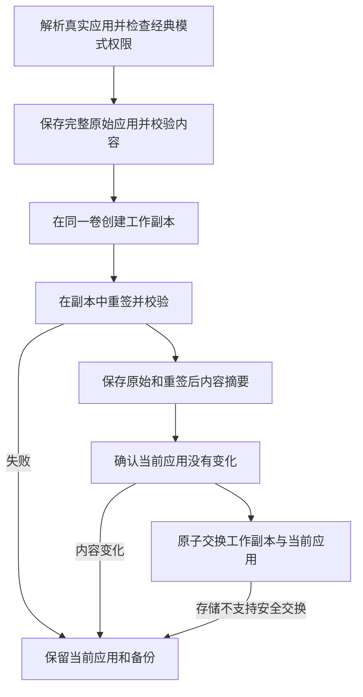

# 重签名与崩溃防护


**重签名不是通用修复手段**

Ad-hoc 重签名会替换应用的开发者签名，并移除沙盒、应用组和钥匙串授权。对沙盒应用（微信、App Store 应用等）来说，这可能让它在 macOS 27 上无法打开，登录态也可能丢失。新版会先保存完整原始应用，之后可以恢复签名和原有授权；已经丢失的登录态不保证随签名恢复。

从 1.9.0 起，AppPorts 默认拒绝重签名沙盒应用；开启经典模式并确认风险后才允许。容器数据的迁移改用[挂载迁移](mount-migration.md)，不需要动签名。来龙去脉见[容器数据、沙盒与签名身份](container-identity.md)。


## 重签名解决什么问题 

macOS 用代码签名校验应用包的完整性。把应用本体迁到外置盘、本地只留启动壳之后，某些情况下系统会认为应用被改过，弹出「已损坏」或「来自身份不明的开发者」，拒绝启动。这时对**外置盘上的真实应用**做一次 Ad-hoc 重签名可以让它通过校验。

这是重签名唯一的用途。它和数据目录迁移没有关系；旧版本把它和容器数据迁移绑在一起，是 macOS 27 故障的来源。

## 什么时候不要用 

| 情况 | 说明 |
|------|------|
| 沙盒应用 | 默认拒绝；经典模式确认风险后允许，但应优先使用挂载迁移 |
| App Store 应用 | 受 SIP 保护，签不了 |
| 依赖钥匙串登录态的应用 | 重签名后登录态丢失 |
| 有小组件、分享扩展的应用 | 应用组授权丢失，扩展读不到共享数据 |
| 应用本身能正常打开 | 没有问题就不要签 |

只在"迁移到外置盘后确实弹了已损坏"这一种情况下考虑，而且先试试重装或从官网重新下载。

## 入口与开关 

| 入口 | 位置 | 默认 | 行为 |
|------|------|------|------|
| 重签名此应用 | 应用列表右键菜单 | 手动 | 先完整备份，再在工作副本签名；默认拒绝沙盒应用，经典模式需确认风险 |
| 迁移后重签名 | 数据目录页顶部工具栏，仅经典模式显示 | 关 | 符号链接迁移完成后对关联应用重签名 |
| 开机自动重签名 | 设置页 | 新安装关 | 仅处理旧版记录；有完整快照的新记录会跳过，避免绕过签名事务 |
| 恢复原始签名 | 应用列表右键菜单、数据页工具栏、修复面板 | 手动 | 从完整备份恢复原应用；旧记录可选择同版本官方原版。无需开发者私钥 |

沙盒判定读取**真实应用**（不是本地启动壳）的授权信息，`com.apple.security.app-sandbox` 为 true 即拒绝。开启[经典数据迁移模式](../settings.md#classic-data-migration-mode)后允许对沙盒应用重签名，每次带二次确认。

## 签名流程 

本地启动壳会先解析到真实应用，签名与恢复都作用于真实 `.app`，不会覆盖启动壳。工作副本签名或校验失败时，当前应用不变；对应用原有的锁定状态也会保留。

## 签名备份与恢复 

**完整备份可以恢复第三方开发者签名，不需要开发者私钥。** 原始签名已经包含在应用文件中；恢复是还原这些原始文件，而不是再用开发者身份签一次。主程序、嵌套帮助程序、框架、签名资源和原有授权都随原应用保存。原本是 Ad-hoc 签名或未签名的应用，也恢复到各自的原始状态。

备份位于 `~/Library/Application Support/AppPorts/signature-backups/`，包括应用标识对应的 `.plist` 记录和 `original-…app` 原始副本。记录使用版本 2 格式，保存原始内容及已重签内容的摘要。支持的文件系统优先使用写时复制；其它情况需要完整复制，因此应留出备份与工作副本所需空间。空间不足或复制失败会中止签名。

恢复步骤：

1. 退出应用。
2. 如果用经典模式迁移过容器数据，先在「应用数据」中还原对应目录。恢复沙盒身份后，应用不能再通过符号链接读取容器外的数据；AppPorts 会检查并阻止跳过这一步。
3. 在应用右键菜单、数据页工具栏或修复面板点击「恢复原始签名」。
4. AppPorts 校验备份、检查当前应用是否更新或改变，在工作副本中验证原始签名后，再安全替换当前应用。成功后清理备份。

**应用更新、内容改变或备份损坏时，恢复会停止并保留当前应用和备份。** 不会用旧版应用覆盖新版，也不会把新版重签结果和旧版备份混用。不支持原子交换的存储需要先把应用迁回本地，再执行签名操作。普通扫描不会自动删除恢复材料。

官方更新或重装后，如果当前应用通过严格签名校验且开发者身份与记录一致，再次重签名会为当前应用建立新的完整备份。旧记录归档到 `signature-backups/retired/`，对应的旧原始副本也会保留，不会混入新版恢复流程。归档副本仍会占用磁盘空间；确认不再需要旧版后，可按归档记录中的 `snapshotName` 找到对应副本再清理。

### 旧版只有身份名称的备份怎么办？ 

旧版 `.plist` 只有应用标识、签名身份名称、路径和时间，没有原始程序与授权数据，不能据此还原签名。旧版把 Ad-hoc 记录当作「移除签名」，或用身份名称重新签名的行为，均不是真正的恢复。

新版会保留这些记录并提供「选择原版应用…」：从官方渠道取得**同一应用、同一版本**的原版 `.app`，AppPorts 校验 Bundle ID、版本及签名；原记录包含开发者身份时，还会核对该身份。通过后把原版恢复到当前真实应用的位置，本地启动入口仍然有效。所选原版不会被修改。

找不到同版本原版时，请按[修复步骤](../macos-27.md#xiu-fu)还原数据、迁回本地，再从官方渠道重新安装。仅凭旧记录无法凭空补回此前丢失的签名。

## 相关的应用类型风险 

这些和重签名无直接关系，但常一起被问到：

| 应用类型 | 风险 | 说明 |
|----------|------|------|
| Sparkle / Electron 自更新应用 | 高 | 更新器可能删掉或替换外置盘上的应用，迁移时用「锁定迁移」 |
| Chrome / Edge | 中 | 更新装回本地，AppPorts 标记「待迁出」提示再迁一次 |
| App Store 应用 | 高 | 签不了；macOS 15.1+ 建议用 App Store 自带的外置安装 |

详见[自更新应用识别](../migration-strategy/updater-detection.md)和[应用类型与策略对照](../migration-strategy/strategy-map.md)。
