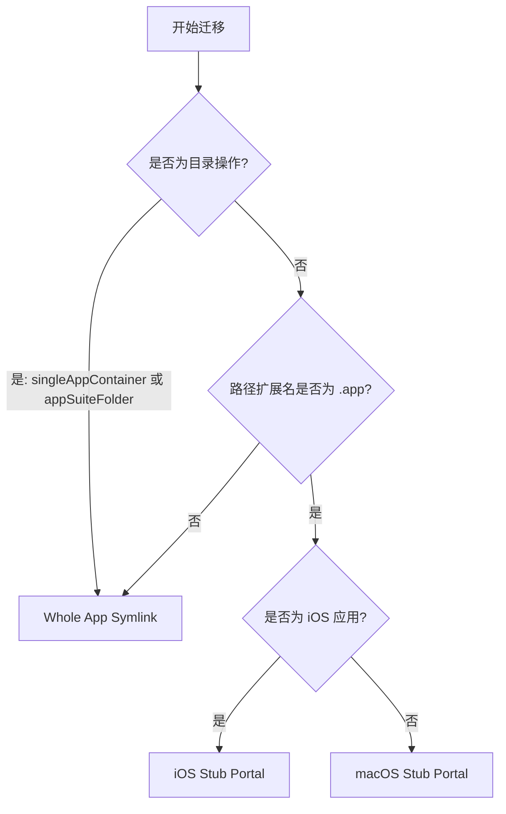

# 迁移策略

## 应用容器分类 <a href="#应用容器分类" id="应用容器分类"></a>

AppPorts 会在迁移前对应用进行分类，以确定迁移粒度：

| 分类 | 定义 | 示例 |
|------|------|------|
| `standaloneApp` | 顶层目录中的单个 `.app` 包 | Safari、Finder |
| `singleAppContainer` | 目录中仅包含 1 个 `.app` 包 | 部分第三方应用的安装目录 |
| `appSuiteFolder` | 目录中包含 2 个及以上 `.app` 包 | Microsoft Office、Adobe Creative Cloud |

分类结果会影响迁移策略的选择：`singleAppContainer` 和 `appSuiteFolder` 会以整个目录为单位迁移，而不是单独处理其中的 `.app` 文件。

## 三种迁移策略 <a href="#三种迁移策略" id="三种迁移策略"></a>

AppPorts 定义了三种本地入口（Portal）策略，用于在迁移后保持应用仍可从本地启动：

### Whole App Symlink（整体符号链接） <a href="#whole-app-symlink-整体符号链接" id="whole-app-symlink-整体符号链接"></a>

将整个 `.app` 目录（或目录）创建为指向外部存储的符号链接。

```text
/Applications/SomeApp.app → /Volumes/External/SomeApp.app
```

**适用场景：**

- 应用容器分类为 `singleAppContainer` 或 `appSuiteFolder`（目录操作）
- 路径扩展名不为 `.app` 的非标准应用

**特征：** Finder 图标会显示快捷方式箭头标记。

### Deep Contents Wrapper（Contents 目录迁移） <a href="#deep-contents-wrapper-contents-目录迁移" id="deep-contents-wrapper-contents-目录迁移"></a>

在本地创建真实的 `.app` 目录，仅将 `Contents/` 子目录符号链接到外部存储。

```text
/Applications/SomeApp.app/
└── Contents → /Volumes/External/SomeApp.app/Contents  （符号链接）
```

**当前状态：** 已弃用。新迁移不再使用此策略，仅在还原旧版本迁移的应用时进行识别和处理。

**弃用原因：** 自更新程序运行时可能沿 `Contents/` 符号链接直接操作外部存储上的文件，从而破坏应用本体。

### Stub Portal（壳门方案） <a href="#stub-portal-壳门方案" id="stub-portal-壳门方案"></a>

在本地创建最小化的 `.app` 壳，通过启动器调用 `open` 命令打开外部存储上的真实应用。

```text
/Applications/SomeApp.app/
├── Contents/
│   ├── MacOS/launcher                    # 原生二进制启动器（或 bash 脚本）
│   ├── Resources/real_app_path.txt       # 外部真实应用路径
│   ├── Resources/AppIcon.icns            # 从真实应用复制的图标
│   ├── Info.plist                        # 精简生成的配置文件
│   └── PkgInfo                           # 标准标识文件
```

**适用场景：** 所有 `.app` 扩展名的应用（默认策略）。

**特征：** 本地不包含符号链接，Finder 不显示箭头标记，自更新程序无法沿链接穿透到外部应用。

#### macOS Stub Portal <a href="#macos-stub-portal" id="macos-stub-portal"></a>

适用于原生 macOS 应用，流程如下：

1. 创建 `Contents/MacOS/launcher` 原生二进制启动器，并在 `Contents/Resources/real_app_path.txt` 中写入外部应用路径。
2. 从外部应用复制 `PkgInfo` 和图标文件。
3. 基于外部应用的 `Info.plist` 生成精简版本：
   - `CFBundleExecutable` 设为 `launcher`
   - `LSUIElement` 设为 `true`（不在 Dock 显示）
   - 移除 Sparkle/Electron 相关配置键
   - Bundle ID 追加 `.appports.stub` 后缀
4. 执行 Ad-hoc 代码签名。

#### iOS Stub Portal <a href="#ios-stub-portal" id="ios-stub-portal"></a>

适用于 iOS 应用（在 Mac 上运行的 iOS 应用），与 macOS 版本的差异：

- 图标从 `Wrapper/` 或 `WrappedBundle/` 目录内的 `.app` 包中提取。
- 使用 `sips` 将 PNG 缩放至 256×256，并转换为 `.icns` 格式。
- `Info.plist` 从 `iTunesMetadata.plist` 生成（iOS 应用不包含标准 `Info.plist`）。
- 不执行代码签名，仅清理扩展属性（`xattr -cr`）。

## 策略选择决策树 <a href="#策略选择决策树" id="策略选择决策树"></a>




**关于 Deep Contents Wrapper**

该策略在当前版本中已不再被选为新迁移方案。`preferredPortalKind()` 方法对所有 `.app` 应用统一返回 `stubPortal`。Deep Contents Wrapper 仅在还原历史迁移时作为遗留方案被识别。


## 目标冲突与替换策略 <a href="#目标冲突与替换策略" id="目标冲突与替换策略"></a>

迁移到外部存储时，如果目标位置已经存在同名项目，AppPorts 会先判断它是否可以安全替换：

| 情况 | 处理方式 |
|------|----------|
| 当前应用显示「待迁出」 | 允许清理外部旧副本，并用本地新版替换 |
| 目标是 AppPorts 创建的 Stub Portal | 允许清理后继续迁移 |
| 目标是旧版 Deep Contents Wrapper 或整体符号链接入口 | 允许作为旧迁移入口清理 |
| 目标是无法确认归属的真实应用或目录 | 停止迁移并提示冲突 |

旧版混合迁移入口可能只在 `Contents/Info.plist`、`Contents/MacOS`、`Contents/Resources` 或 `Contents/Frameworks` 等组件上保留符号链接。当前版本会识别这些遗留结构，用于安全清理和还原；但不会把无法识别的真实应用当作残留直接删除。
