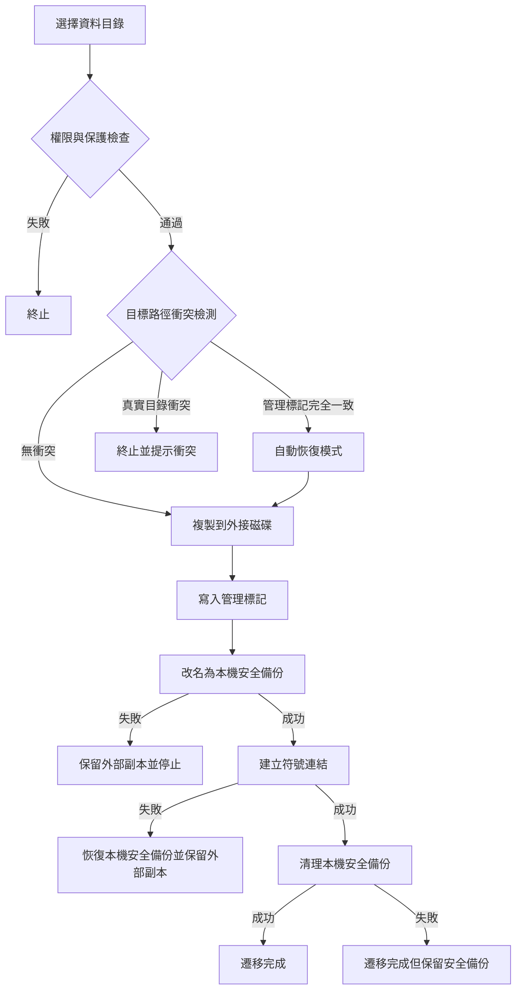

# 資料遷移基礎實作


AppPorts 的資料遷移把應用程式關聯的資料目錄搬到外接磁碟，釋放本機空間。按目錄所在位置用兩種策略：

| 目錄 | 策略 | 原因 |
|------|------|------|
| `~/Library/Containers/`、`~/Library/Group Containers/` | 掛載遷移 | 沙盒檢查解析後的真實路徑，符號連結指向容器外會被拒絕 |
| 其他 `~/Library/` 子目錄、工具目錄、自訂資料夾 | 符號連結 | 不受沙盒限制，最簡單 |

本頁講符號連結策略。掛載遷移見[掛載遷移](mount-migration.md)。

## 符號連結策略 <a href="#符號連結策略" id="符號連結策略"></a>

1. 把本機目錄完整複製到外接磁碟。
2. 在外部目錄寫入管理標記 `.appports-link-metadata.plist`。
3. 把本機原目錄改名為同一卷宗上的隱藏安全備份。
4. 在原路徑建立指向外部副本的符號連結。
5. 連結建立成功後清理安全備份。

```
~/Library/Application Support/SomeApp
    → /Volumes/External/AppPortsData/SomeApp  （符号链接）
```



## 管理標記 <a href="#管理標記" id="管理標記"></a>

外部目錄裡的 `.appports-link-metadata.plist` 標示該目錄由 AppPorts 管理：

| 欄位 | 說明 |
|------|------|
| `schemaVersion` | 版本號，目前為 1 |
| `managedBy` | `com.shimoko.AppPorts` |
| `sourcePath` | 原始本機路徑 |
| `destinationPath` | 外部目標路徑 |
| `dataDirType` | 資料目錄類型 |

掃描時用它區分 AppPorts 建的連結和使用者自己建的連結；遷移中斷時用它自動恢復。比對是嚴格的：五個欄位全部一致才算可接續的管理目錄，否則視為衝突，不會因為目錄大小相近就接管或覆蓋。

接回和整理只對目錄有效，不會把外部一般檔案當作目錄重新連結。

## 支援的資料目錄類型 <a href="#支援的資料目錄類型" id="支援的資料目錄類型"></a>

| 類型 | 路徑 | 策略 |
|------|------|------|
| `applicationSupport` | `~/Library/Application Support/` | 符號連結 |
| `preferences` | `~/Library/Preferences/` | 符號連結 |
| `containers` | `~/Library/Containers/` | 掛載 |
| `groupContainers` | `~/Library/Group Containers/` | 掛載 |
| `caches` | `~/Library/Caches/` | 符號連結 |
| `webKit` | `~/Library/WebKit/` | 符號連結 |
| `httpStorages` | `~/Library/HTTPStorages/` | 符號連結 |
| `applicationScripts` | `~/Library/Application Scripts/` | 符號連結 |
| `logs` | `~/Library/Logs/` | 符號連結 |
| `savedState` | `~/Library/Saved Application State/` | 符號連結 |
| `dotFolder` | `~/.npm`、`~/.vscode` 等 | 符號連結 |
| `custom` | 使用者自訂路徑 | 符號連結 |

## 還原流程 <a href="#還原流程" id="還原流程"></a>

1. 確認本機路徑是符號連結，且指向有效的外部目錄。
2. 把外部目錄複製到本機暫存目錄。
3. 刪除符號連結，把暫存目錄改名為原路徑。
4. 刪除外部目錄（盡力而為）。

複製失敗時不變更符號連結；改名失敗時重建符號連結並保留暫存目錄供手動恢復。

## 錯誤處理與回復 <a href="#錯誤處理與回復" id="錯誤處理與回復"></a>

- **複製失敗**：清理已複製的外部檔案，不做後續操作。
- **目標衝突**：外部已有真實目錄且標記不比對，停止並保留雙方資料。
- **改名安全備份失敗**：停止並保留外部副本，本機源目錄不變更。
- **建立符號連結失敗**：把安全備份恢復回原路徑，同時保留外部副本。
- **清理安全備份失敗**：遷移算完成，本機保留 `.appports-migration-backup-*`，確認無誤後可手動刪除。
