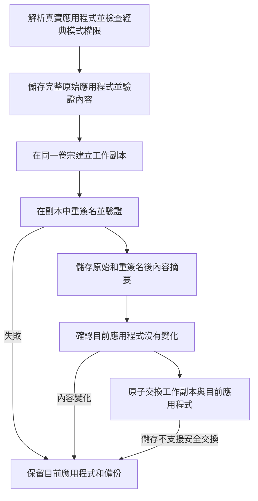

# 重簽名與當機防護


**重簽名不是通用修復手段**

Ad-hoc 重簽名會替換應用程式的開發者簽名，並移除沙盒、應用程式群組和鑰匙圈授權。對沙盒應用程式（微信、App Store 應用程式等）來說，這可能讓它在 macOS 27 上無法開啟，登入狀態也可能遺失。新版會先儲存完整原始應用程式，之後可以恢復簽名和原有授權；已經遺失的登入狀態不保證隨簽名恢復。

從 1.9.0 起，AppPorts 預設拒絕重簽名沙盒應用程式；開啟經典模式並確認風險後才允許。容器資料的遷移改用[掛載遷移](mount-migration.md)，不需要動簽名。來龍去脈見[容器資料、沙盒與簽名身分](container-identity.md)。


## 重簽名解決什麼問題 

macOS 用程式碼簽名驗證應用程式套件的完整性。把應用程式本體遷到外接磁碟、本機只留啟動殼之後，某些情況下系統會認為應用程式被改過，彈出「已損壞」或「來自身分不明的開發者」，拒絕啟動。這時對**外接磁碟上的真實應用程式**做一次 Ad-hoc 重簽名可以讓它通過驗證。

這是重簽名唯一的用途。它和資料目錄遷移沒有關係；舊版本把它和容器資料遷移綁在一起，是 macOS 27 故障的來源。

## 什麼時候不要用 

| 情況 | 說明 |
|------|------|
| 沙盒應用程式 | 預設拒絕；經典模式確認風險後允許，但應優先使用掛載遷移 |
| App Store 應用程式 | 受 SIP 保護，無法簽名 |
| 依賴鑰匙圈登入狀態的應用程式 | 重簽名後登入狀態遺失 |
| 有小工具、分享延伸功能的應用程式 | 應用程式群組授權遺失，延伸功能讀不到共享資料 |
| 應用程式本身能正常開啟 | 沒有問題就不需要重簽名 |

只在"遷移到外接磁碟後確實彈了已損壞"這一種情況下考慮，而且先試試重新安裝或從官網重新下載。

## 入口與開關 

| 入口 | 位置 | 預設 | 行為 |
|------|------|------|------|
| 重簽名此應用 | 應用程式清單右鍵選單 | 手動 | 先完整備份，再在工作副本簽名；預設拒絕沙盒應用程式，經典模式需確認風險 |
| 遷移后重签名 | 資料目錄頁頂部工具列，僅經典模式顯示 | 關 | 符號連結遷移完成後對關聯應用程式重簽名 |
| 開機自動重簽名 | 設定頁 | 新安裝關 | 僅處理舊版記錄；有完整快照的新記錄會跳過，避免繞過簽名交易 |
| 恢復原始簽名 | 應用程式清單右鍵選單、資料頁工具列、修復面板 | 手動 | 從完整備份恢復原應用程式；舊記錄可選擇同版本官方原版。無需開發者私鑰 |

沙盒判定讀取**真實應用程式**（不是本機啟動殼）的授權資訊，`com.apple.security.app-sandbox` 為 true 即拒絕。開啟[經典資料遷移模式](../settings.md#classic-data-migration-mode)後允許對沙盒應用程式重簽名，每次帶二次確認。

## 簽名流程 

本機啟動殼會先解析到真實應用程式，簽名與恢復都作用於真實 `.app`，不會覆蓋啟動殼。工作副本簽名或驗證失敗時，目前應用程式不變；對應用程式原有的鎖定狀態也會保留。

## 簽名備份與恢復 

**完整備份可以恢復第三方開發者簽名，不需要開發者私鑰。** 原始簽名已經包含在應用程式檔案中；恢復是還原這些原始檔案，而不是再用開發者身分籤一次。主程式、巢狀輔助程式、框架、簽名資源和原有授權都隨原應用程式儲存。原本是 Ad-hoc 簽名或未簽名的應用程式，也恢復到各自的原始狀態。

備份位於 `~/Library/Application Support/AppPorts/signature-backups/`，包括應用程式識別碼對應的 `.plist` 記錄和 `original-…app` 原始副本。記錄使用版本 2 格式，儲存原始內容及已重簽名內容的摘要。支援的檔案系統優先使用寫時複製；其他情況需要完整複製，因此應留出備份與工作副本所需空間。空間不足或複製失敗會中止簽名。

恢復步驟：

1. 退出應用程式。
2. 如果用經典模式遷移過容器資料，先在「應用程式資料」中還原對應目錄。恢復沙盒身分後，應用程式不能再透過符號連結讀取容器外的資料；AppPorts 會檢查並阻止跳過這一步。
3. 在應用程式右鍵選單、資料頁工具列或修復面板按一下「恢復原始簽名」。
4. AppPorts 驗證備份、檢查目前應用程式是否更新或改變，在工作副本中驗證原始簽名後，再安全替換目前應用程式。成功後清理備份。

**應用程式更新、內容改變或備份損壞時，恢復會停止並保留目前應用程式和備份。** 不會用舊版應用程式覆蓋新版，也不會把新版重簽結果和舊版備份混用。不支援原子交換的儲存需要先把應用程式遷回本機，再執行簽名操作。一般掃描不會自動刪除恢復材料。

官方更新或重新安裝後，如果目前應用程式通過嚴格簽名驗證且開發者身分與記錄一致，再次重簽名會為目前應用程式建立新的完整備份。舊記錄歸檔到 `signature-backups/retired/`，對應的舊原始副本也會保留，不會混入新版恢復流程。歸檔副本仍會佔用磁碟空間；確認不再需要舊版後，可按歸檔記錄中的 `snapshotName` 找到對應副本再清理。

### 舊版只有身分名稱的備份怎麼辦？ 

舊版 `.plist` 只有應用程式識別碼、簽名身分名稱、路徑和時間，沒有原始程式與授權資料，不能據此還原簽名。舊版把 Ad-hoc 記錄當作「移除簽名」，或用身分名稱重新簽名的行為，均不是真正的恢復。

新版會保留這些記錄並提供「選擇原版應用程式…」：從官方管道取得**同一應用程式、同一版本**的原版 `.app`，AppPorts 驗證 Bundle ID、版本及簽名；原記錄包含開發者身分時，還會核對該身分。透過後把原版恢復到目前真實應用程式的位置，本機啟動入口仍然有效。所選原版不會被修改。

找不到同版本原版時，請按[修復步驟](../macos-27.md#xiu-fu)還原資料、遷回本機，再從官方管道重新安裝。僅憑舊記錄無法憑空補回此前遺失的簽名。

## 相關的應用程式類型風險 

這些和重簽名無直接關係，但常一起被問到：

| 應用程式類型 | 風險 | 說明 |
|----------|------|------|
| Sparkle / Electron 自更新應用程式 | 高 | 更新器可能刪掉或替換外接磁碟上的應用程式，遷移時用「锁定遷移」 |
| Chrome / Edge | 中 | 更新裝回本機，AppPorts 標記「待遷出」提示再遷一次 |
| App Store 應用程式 | 高 | 無法簽名；macOS 15.1+ 建議用 App Store 內建的外接安裝 |

詳見[自更新應用程式辨識](../migration-strategy/updater-detection.md)和[應用程式類型與策略對照](../migration-strategy/strategy-map.md)。
